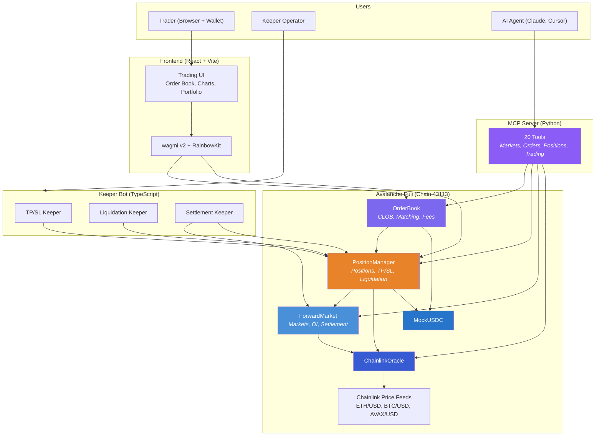

<p align="center">
  
  
  
  
  
  
</p>

<h1 align="center">Tenor Protocol</h1>
<p align="center"><strong>The First Decentralized Non-Deliverable Forward Exchange on Avalanche</strong></p>

<p align="center">
  Trade crypto forward contracts with a fully on-chain order book, Chainlink oracle settlement, automated keeper bots, and zero counterparty risk.
</p>

---

## What is Tenor?

**Tenor** brings Non-Deliverable Forwards (NDFs) -- a [$7 trillion/day](https://www.bis.org/statistics/rpfx22_fx.pdf) traditional finance instrument -- to DeFi for the first time on Avalanche.

A forward contract is an agreement between two parties on a future price. At expiration, Tenor settles the **price difference** in USDC using Chainlink oracle prices. No physical delivery of the underlying asset -- pure price exposure, fully collateralized on-chain.

```
Example: ETH/USDC 30-day Forward

Alice goes LONG  at $2,500 (5 contracts)  -->  deposits $25,000 USDC collateral
Bob   goes SHORT at $2,500 (5 contracts)  -->  deposits $25,000 USDC collateral

30 days later, ETH settles at $2,800 (via Chainlink oracle):

Alice PnL: ($2,800 - $2,500) x 5 = +$1,500  -->  receives $26,500
Bob   PnL: ($2,500 - $2,800) x 5 = -$1,500  -->  receives $23,500
```

---

## Architecture



---

## Key Features

| Feature | Description |
|---|---|
| **On-Chain CLOB** | Full limit order book with price-time priority matching, partial fills, and market orders |
| **Chainlink Oracles** | Live price feeds (ETH/USD, BTC/USD, AVAX/USD) for trustless settlement |
| **TP/SL Orders** | On-chain take-profit and stop-loss with automated keeper execution |
| **Liquidation Engine** | Health-factor-based liquidation with 5% bonus to liquidators |
| **Cash Settlement** | Automatic PnL calculation and USDC distribution at forward expiry |
| **1-Click Trading** | Single USDC approval enables instant order placement |
| **Keeper Bot** | Automated settlement, TP/SL triggering, and liquidation with retry logic |
| **CLI Tool** | Full command-line interface for trading, monitoring, and keeper operations |
| **AI-Native (MCP)** | Model Context Protocol server — AI agents can read markets and trade on Tenor directly |

---

## Documentation

| Document | Description |
|---|---|
| **[Architecture](docs/ARCHITECTURE.md)** | System design, contract relationships, deployed addresses, tech stack |
| **[Order Matching](docs/MATCHING.md)** | CLOB mechanics, matching algorithm, collateral, partial fills, fees |
| **[TP/SL](docs/TPSL.md)** | Take-profit/stop-loss mechanics, keeper execution, position lifecycle |
| **[Settlement](docs/SETTLEMENT.md)** | Forward expiry, oracle settlement, batch processing, payout math |
| **[MCP Server](mcp/README.md)** | AI-native interface — 20 tools for reading and trading on Tenor |

---

## Deployed Contracts (Avalanche Fuji -- v4)

| Contract | Address | Explorer |
|---|---|---|
| **MockUSDC** | `0xA41BCF380ff358c849619538fda0Dd38214E019d` | [SnowTrace](https://testnet.snowtrace.io/address/0xA41BCF380ff358c849619538fda0Dd38214E019d) |
| **MockWETH** | `0xC2DFD7581C9D27ac195C3873f12b93e7eCd4B24c` | [SnowTrace](https://testnet.snowtrace.io/address/0xC2DFD7581C9D27ac195C3873f12b93e7eCd4B24c) |
| **ChainlinkOracle** | `0x23196688CDc03348d712BBc2E74CeA4Eea1e60EB` | [SnowTrace](https://testnet.snowtrace.io/address/0x23196688CDc03348d712BBc2E74CeA4Eea1e60EB) |
| **ForwardMarket** | `0x281dc4C64D2BF3508bA2670897f321a31F5e1e65` | [SnowTrace](https://testnet.snowtrace.io/address/0x281dc4C64D2BF3508bA2670897f321a31F5e1e65) |
| **OrderBook** | `0x74AeE1AdBcE40B984beA4B09deAf581c6139cbC9` | [SnowTrace](https://testnet.snowtrace.io/address/0x74AeE1AdBcE40B984beA4B09deAf581c6139cbC9) |
| **PositionManager** | `0xAB6b565384773C70da8D9e254aFB4B59d710eaD7` | [SnowTrace](https://testnet.snowtrace.io/address/0xAB6b565384773C70da8D9e254aFB4B59d710eaD7) |

**Network:** Avalanche Fuji Testnet (Chain ID: 43113)

---

## Project Structure

```
tenor-protocol/
├── contracts/                 # Solidity smart contracts (Foundry)
│   ├── src/
│   │   ├── core/
│   │   │   ├── ForwardMarket.sol       # Market creation, settlement, OI tracking
│   │   │   ├── OrderBook.sol           # On-chain CLOB with matching engine
│   │   │   └── PositionManager.sol     # Positions, collateral, TP/SL, liquidation
│   │   ├── oracle/
│   │   │   ├── ChainlinkOracle.sol     # Live Chainlink price feeds
│   │   │   ├── PriceOracle.sol         # IPriceOracle interface
│   │   │   └── MockOracle.sol          # Mock oracle for testing
│   │   ├── tokens/
│   │   │   ├── MockUSDC.sol            # ERC20 USDC (6 dec, faucet enabled)
│   │   │   └── MockWETH.sol            # ERC20 WETH
│   │   ├── libraries/
│   │   │   ├── MathLib.sol             # PnL, health factor, collateral math
│   │   │   └── OrderLib.sol            # Structs & enums
│   │   └── interfaces/                 # Contract interfaces
│   ├── script/Deploy.s.sol             # Automated Fuji deployment
│   └── test/                           # Unit & integration tests
├── frontend/                  # React trading interface
│   └── src/
│       ├── pages/             # Landing, Trade, Markets, Portfolio
│       ├── components/        # Trading UI, order book, charts
│       ├── hooks/             # wagmi contract hooks
│       ├── providers/         # Web3 (wagmi + RainbowKit + Fuji)
│       └── lib/               # ABIs, config, utilities
├── mcp/                      # MCP server (AI-native interface)
│   ├── tenor_mcp/
│   │   ├── server.py                  # FastMCP server with 20 tools
│   │   ├── contracts.py               # On-chain reads/writes via cast
│   │   └── config.py                  # Contract addresses, RPC, constants
│   └── pyproject.toml
├── keeper/                    # Keeper bot + CLI
│   └── src/
│       ├── cli.ts             # Full CLI for trading & monitoring
│       ├── index.ts           # Keeper main loop
│       ├── config.ts          # Environment configuration
│       ├── contracts.ts       # viem contract instances + ABIs
│       ├── services/
│       │   ├── tpslKeeper.ts        # TP/SL trigger detection & execution
│       │   ├── liquidationKeeper.ts # Liquidation detection & execution
│       │   ├── settlementKeeper.ts  # Market & position settlement
│       │   ├── positionMonitor.ts   # Position fetching with multicall
│       │   └── priceService.ts      # Oracle price fetching
│       └── utils/
│           ├── logger.ts      # Structured logging
│           └── retry.ts       # Retry with exponential backoff
└── docs/                      # Documentation
    ├── ARCHITECTURE.md        # Protocol architecture
    ├── MATCHING.md            # Order matching engine
    ├── TPSL.md                # Take-profit / stop-loss
    └── SETTLEMENT.md          # Forward settlement
```

---

## Quick Start

### Prerequisites

- [Foundry](https://book.getfoundry.sh/getting-started/installation) (for smart contracts)
- Node.js 18+ (for frontend and keeper)
- MetaMask or compatible wallet with [Fuji AVAX](https://faucet.avax.network/)

### Smart Contracts

```bash
cd contracts

# Install dependencies
forge install

# Run tests
forge test -vvv

# Deploy to Fuji (with Chainlink Oracle)
USE_CHAINLINK=true forge script script/Deploy.s.sol \
  --rpc-url https://api.avax-test.network/ext/bc/C/rpc \
  --broadcast --private-key $PRIVATE_KEY
```

### Frontend

```bash
cd frontend

npm install
npm run dev          # Development server at localhost:5173
npm run build        # Production build
```

### MCP Server (AI Agents)

```bash
cd mcp

python3 -m venv .venv
.venv/bin/pip install -e .

# Start the MCP server (connects to Claude Code, Cursor, etc.)
.venv/bin/tenor-mcp

# Or with trading capabilities:
TENOR_PRIVATE_KEY=0x... .venv/bin/tenor-mcp
```

Add to Claude Code or Cursor MCP settings:
```json
{
  "mcpServers": {
    "tenor": { "command": "/path/to/mcp/.venv/bin/tenor-mcp" }
  }
}
```

Then ask your AI agent: *"What's the ETH order book?"* or *"Place a 5-contract long at $1900"*

### Keeper Bot

```bash
cd keeper

npm install

# Set environment variables
export KEEPER_PRIVATE_KEY=0x...
export RPC_URL=https://avalanche-fuji-c-chain-rpc.publicnode.com

# Start the keeper (automated TP/SL, liquidation, settlement)
npx tsx src/cli.ts keeper

# Or use the CLI for manual operations
npx tsx src/cli.ts markets           # List all markets
npx tsx src/cli.ts prices            # Live oracle prices
npx tsx src/cli.ts faucet            # Mint 10,000 test USDC
npx tsx src/cli.ts trade long ETH 5 --price 2500   # Place limit order
npx tsx src/cli.ts trade short ETH 3 --market       # Place market order
npx tsx src/cli.ts tpsl 1 --tp 3000 --sl 2000       # Set TP/SL
npx tsx src/cli.ts positions --mine                  # View your positions
npx tsx src/cli.ts close 1 --percent 50              # Partial close
```

---

## How It Works (E2E)

```
1. Connect Wallet      -->  MetaMask on Avalanche Fuji
2. Get Test USDC       -->  Click "Faucet 10k USDC" or use CLI
3. Enable 1-Click      -->  One-time USDC approval for OrderBook
4. Choose Market       -->  ETH/USDC, BTC/USDC, or AVAX/USDC forward
5. Place Order         -->  Limit or market, long or short, with optional TP/SL
6. Automatic Match     -->  Orders match on-chain when prices cross
7. Monitor Position    -->  Track PnL, health factor, TP/SL in Portfolio
8. Exit                -->  Close early, TP/SL trigger, or wait for settlement
```

---

## Tech Stack

| Layer | Technology |
|---|---|
| Smart Contracts | Solidity 0.8.24, Foundry, OpenZeppelin |
| Oracle | Chainlink AggregatorV3 (live Fuji feeds) |
| Frontend | React 18, Vite, TypeScript, Tailwind CSS v4, Framer Motion |
| Web3 | wagmi v2, viem, RainbowKit |
| Keeper | TypeScript, viem, Multicall3 |
| MCP Server | Python, FastMCP, Foundry cast |
| Charts | TradingView Lightweight Charts |
| Notifications | Sonner (toast notifications) |
| Chain | Avalanche Fuji Testnet (43113) |

---

## Testing

```bash
cd contracts && forge test -vvv
```

**20 tests** across three suites:

| Suite | Tests | Coverage |
|---|---|---|
| ForwardMarket | 8 | Market creation, settlement, reverts, active filtering |
| OrderBook | 7 | Limit orders, matching, partial fills, cancellation, price crossing |
| Settlement | 5 | Long/short profit, liquidation, collateral management, guards |

---

## Why Tenor Matters

| TradFi NDFs | Tenor Protocol |
|---|---|
| $7T daily volume, banks only | Permissionless, anyone can trade |
| Bilateral, counterparty risk | Smart contract escrow, zero default risk |
| T+2 settlement, manual processes | Instant settlement via Chainlink oracle |
| Opaque OTC market | Transparent on-chain order book |
| $1M+ minimum notional | Trade any size |
| No automated risk management | On-chain TP/SL, liquidation, keeper bots |

---

## License

MIT
