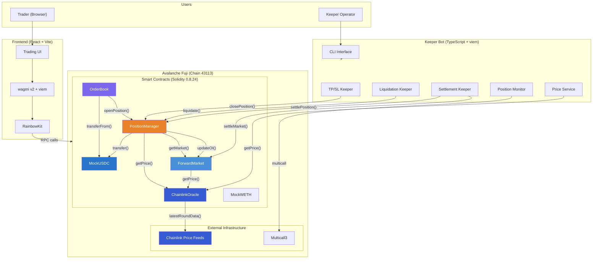
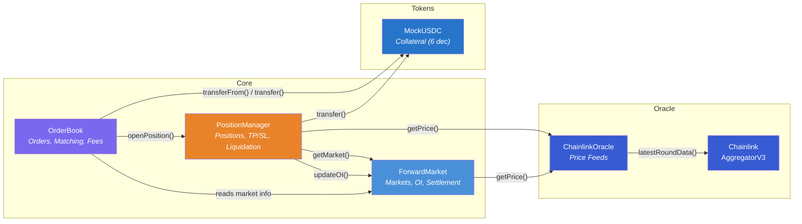

# Protocol Architecture

Tenor is a decentralized Non-Deliverable Forward (NDF) exchange built on Avalanche. It allows permissionless trading of cash-settled forward contracts on crypto assets, with fully on-chain order matching, Chainlink oracle pricing, and automated position management.

Forward contracts on Tenor work like this: two parties agree on a future price for an asset. At expiration, instead of delivering the underlying asset, the contract settles the price difference in USDC. The protocol holds collateral from both sides and distributes payouts based on the settlement price provided by Chainlink oracles.

---

## System Architecture



---

## Contract Relationships



---

## Smart Contracts

### ForwardMarket

**Role:** Registry and lifecycle manager for forward markets.

Each market defines a tradeable forward contract with a base asset (e.g., ETH), quote asset (e.g., USDC), expiration timestamp, LTV ratio, liquidation threshold, and minimum collateral. At expiry, anyone can call `settleMarket()` to lock in the Chainlink oracle price as the settlement price.

| Function | Description |
|---|---|
| `createMarket(baseAsset, quoteAsset, expiration, ltv, liquidationThreshold, minCollateral)` | Creates a new forward market with configurable risk parameters |
| `settleMarket(marketId)` | Settles an expired market by reading the oracle price and locking it as the settlement price |
| `getMarket(marketId)` | Returns full market info (expiration, LTV, OI, settlement status) |
| `getActiveMarkets()` | Returns all unsettled markets |
| `getAllMarkets()` | Returns all markets (active + settled) |
| `updateOI(marketId, side, amount, isIncrease)` | Updates open interest tracking (called by PositionManager) |
| `setAuthorized(addr, status)` | Grants/revokes authorization for external contracts to call `updateOI` |

**Key state:**
- `markets` mapping (ID to `MarketInfo` struct)
- `marketIds` array for enumeration
- `authorized` mapping for access control on OI updates

---

### OrderBook

**Role:** On-chain Central Limit Order Book (CLOB) with automatic matching engine and fee collection.

When a trader places an order, the OrderBook calculates the required collateral based on the order price, size, and market LTV, then transfers that USDC from the trader. The matching engine immediately attempts to fill the incoming order against resting orders on the opposite side. Matched quantities are forwarded to the PositionManager to create positions.

| Function | Description |
|---|---|
| `placeLimitOrder(marketId, side, price, amount)` | Places a limit order; collateral is calculated as `(amount * price / PRICE_PRECISION) * COLLATERAL_PRECISION * PERCENT_BASE / ltv`. Attempts immediate matching, unfilled remainder rests in the book |
| `placeMarketOrder(marketId, side, amount)` | Places a market order using extreme price bounds (max for LONG, 1 for SHORT). Collateral is based on `2x oracle price`. Unfilled portion is refunded |
| `cancelOrder(orderId)` | Cancels an open or partially-filled order, refunds remaining collateral |
| `getOrderBook(marketId)` | Returns all open bids and asks for a market |
| `getOrder(orderId)` | Returns a single order's details |
| `getUserOrders(user)` | Returns all orders (any status) for a given trader |
| `setTakerFee(newBps)` | Updates the taker fee (max 10%, in basis points) |
| `setFeeCollector(addr)` | Updates the fee collector address |

**Fee structure:** A taker fee (default 10 bps = 0.10%) is deducted from the incoming (taker) order's collateral at the time of match and sent to the `feeCollector` address.

---

### PositionManager

**Role:** Manages open positions, collateral, TP/SL orders, liquidation, early close, and settlement payout.

Positions are created by the OrderBook after a successful match. Each position tracks the trader, market, side (LONG/SHORT), entry price, size (number of contracts), and locked collateral. The PositionManager handles the full lifecycle from opening through settlement or early exit.

| Function | Description |
|---|---|
| `openPosition(marketId, trader, side, entryPrice, size, collateral)` | Creates a new position (only callable by OrderBook) |
| `closePosition(positionId, closeSize)` | Early close at oracle mark price. `closeSize=0` means full close. Non-owner callers must satisfy TP/SL trigger conditions |
| `setTPSL(positionId, tp, sl)` | Sets take-profit and/or stop-loss price levels. Validates direction (TP above entry for longs, below for shorts; SL the inverse) |
| `addCollateral(positionId, amount)` | Deposits additional USDC collateral to improve health factor |
| `removeCollateral(positionId, amount)` | Withdraws collateral (reverts if position would become liquidatable) |
| `liquidate(positionId)` | Liquidates an unhealthy position (health factor < 100%). Liquidator receives 5% bonus from remaining collateral |
| `settlePosition(positionId)` | Settles a position on an already-settled market. PnL calculated against the market's settlement price |
| `getHealthFactor(positionId)` | Returns current health factor based on live oracle price |
| `getOpenPositionIds(offset, limit)` | Paginated enumeration of all open position IDs (for keeper bot) |
| `getOpenPositionCount()` | Total count of open positions |

**PnL calculation** (from MathLib):
```
Long PnL  = (exitPrice - entryPrice) * size * COLLATERAL_PRECISION / PRICE_PRECISION
Short PnL = (entryPrice - exitPrice) * size * COLLATERAL_PRECISION / PRICE_PRECISION
```

**Health factor** (from MathLib):
```
equity = collateral + PnL
maintenanceMargin = size * entryPrice * liquidationThreshold * COLLATERAL_PRECISION / (PRICE_PRECISION * PERCENT_BASE)
healthFactor = equity * PERCENT_BASE / maintenanceMargin

If healthFactor < 10000 (100%) => position is liquidatable
```

---

### ChainlinkOracle

**Role:** Price oracle that reads live prices from Chainlink AggregatorV3 price feeds. Falls back to manually-set prices for assets without a registered Chainlink feed.

All prices are normalized to 8 decimals. The oracle supports batch-registering multiple feeds and can be used on any EVM chain with Chainlink deployments.

| Function | Description |
|---|---|
| `registerFeed(asset, feed)` | Registers a Chainlink AggregatorV3 address for an asset ticker (e.g., "ETH") |
| `registerFeeds(assets[], feeds[])` | Batch-registers multiple feeds in one transaction |
| `setFallbackPrice(asset, price)` | Sets a manual fallback price (used when no Chainlink feed is registered) |
| `getPrice(asset)` | Returns `(price, timestamp)` from Chainlink if available, otherwise from fallback |
| `transferOwnership(newOwner)` | Transfers oracle admin rights |

**Chainlink feeds on Fuji Testnet:**

| Asset | Chainlink Feed Address |
|---|---|
| ETH/USD | `0x86d67c3D38D2bCeE722E601025C25a575021c6EA` |
| BTC/USD | `0x31CF013A08c6Ac228C94551d535d5BAfE19c602a` |
| AVAX/USD | `0x5498BB86BC934c8D34FDA08E81D444153d0D06aD` |

---

### Libraries

**OrderLib** -- Data structures used across all contracts:
- `Side` enum: `LONG`, `SHORT`
- `OrderStatus` enum: `OPEN`, `FILLED`, `PARTIALLY_FILLED`, `CANCELLED`
- `Order` struct: id, trader, marketId, side, price (8 dec), amount, filled, collateral (6 dec), timestamp, status
- `PositionInfo` struct: id, trader, marketId, side, entryPrice (8 dec), size, collateral (6 dec), timestamp, isOpen
- `TPSLOrder` struct: takeProfitPrice (8 dec), stopLossPrice (8 dec)
- `MarketInfo` struct: id, baseAsset, quoteAsset, expiration, ltv, liquidationThreshold, minCollateral, settlePrice, settled, totalLongOI, totalShortOI

**MathLib** -- Arithmetic helpers:
- `PRICE_PRECISION = 1e8` (8 decimals for prices)
- `COLLATERAL_PRECISION = 1e6` (6 decimals for USDC)
- `PERCENT_BASE = 1e4` (100% = 10000 basis points)
- `calculatePnL()` -- Computes signed PnL in USDC units
- `calculateHealthFactor()` -- Computes position health for liquidation checks
- `min()`, `max()`, `abs()` -- Utility functions

---

### MockUSDC / MockWETH

**MockUSDC** (6 decimals) -- ERC20 mock collateral token with a public `faucet()` that mints 10,000 USDC per call. Used for testnet trading.

**MockWETH** (18 decimals) -- ERC20 mock WETH token for testing purposes.

---

## Keeper Bot

The keeper is a TypeScript service built with `viem` that runs an automated loop every 5 seconds (configurable via `POLL_INTERVAL_MS`). Each cycle:

1. Fetches all markets and unique base assets
2. Reads oracle prices for each asset
3. Fetches all open positions (paginated, using `multicall`)
4. Batch-fetches TP/SL orders and health factors for all positions
5. **Settlement:** Settles expired markets, then settles positions on those markets
6. **TP/SL:** Checks if any TP or SL conditions are met and triggers `closePosition()`
7. **Liquidation:** Checks health factors and calls `liquidate()` on unhealthy positions

The keeper also exposes a CLI (`npx tsx src/cli.ts`) for manual operations: viewing markets, prices, positions, placing trades, setting TP/SL, and closing positions.

---

## Deployed Addresses (Avalanche Fuji -- v4)

| Contract | Address | Explorer |
|---|---|---|
| **MockUSDC** | `0xA41BCF380ff358c849619538fda0Dd38214E019d` | [SnowTrace](https://testnet.snowtrace.io/address/0xA41BCF380ff358c849619538fda0Dd38214E019d) |
| **MockWETH** | `0xC2DFD7581C9D27ac195C3873f12b93e7eCd4B24c` | [SnowTrace](https://testnet.snowtrace.io/address/0xC2DFD7581C9D27ac195C3873f12b93e7eCd4B24c) |
| **ChainlinkOracle** | `0x23196688CDc03348d712BBc2E74CeA4Eea1e60EB` | [SnowTrace](https://testnet.snowtrace.io/address/0x23196688CDc03348d712BBc2E74CeA4Eea1e60EB) |
| **ForwardMarket** | `0x281dc4C64D2BF3508bA2670897f321a31F5e1e65` | [SnowTrace](https://testnet.snowtrace.io/address/0x281dc4C64D2BF3508bA2670897f321a31F5e1e65) |
| **OrderBook** | `0x74AeE1AdBcE40B984beA4B09deAf581c6139cbC9` | [SnowTrace](https://testnet.snowtrace.io/address/0x74AeE1AdBcE40B984beA4B09deAf581c6139cbC9) |
| **PositionManager** | `0xAB6b565384773C70da8D9e254aFB4B59d710eaD7` | [SnowTrace](https://testnet.snowtrace.io/address/0xAB6b565384773C70da8D9e254aFB4B59d710eaD7) |

**Network:** Avalanche Fuji Testnet (Chain ID: 43113)

---

## Tech Stack

| Layer | Technology |
|---|---|
| Smart Contracts | Solidity 0.8.24, Foundry, OpenZeppelin |
| Oracle | Chainlink AggregatorV3 (live Fuji feeds) |
| Frontend | React 18, Vite, TypeScript, Tailwind CSS v4 |
| Web3 Integration | wagmi v2, viem, RainbowKit |
| Keeper Bot | TypeScript, viem, Multicall3 |
| Charts | TradingView Lightweight Charts |
| Notifications | Sonner (toast notifications) |
| Animations | Framer Motion |
| Chain | Avalanche Fuji Testnet (43113) |
