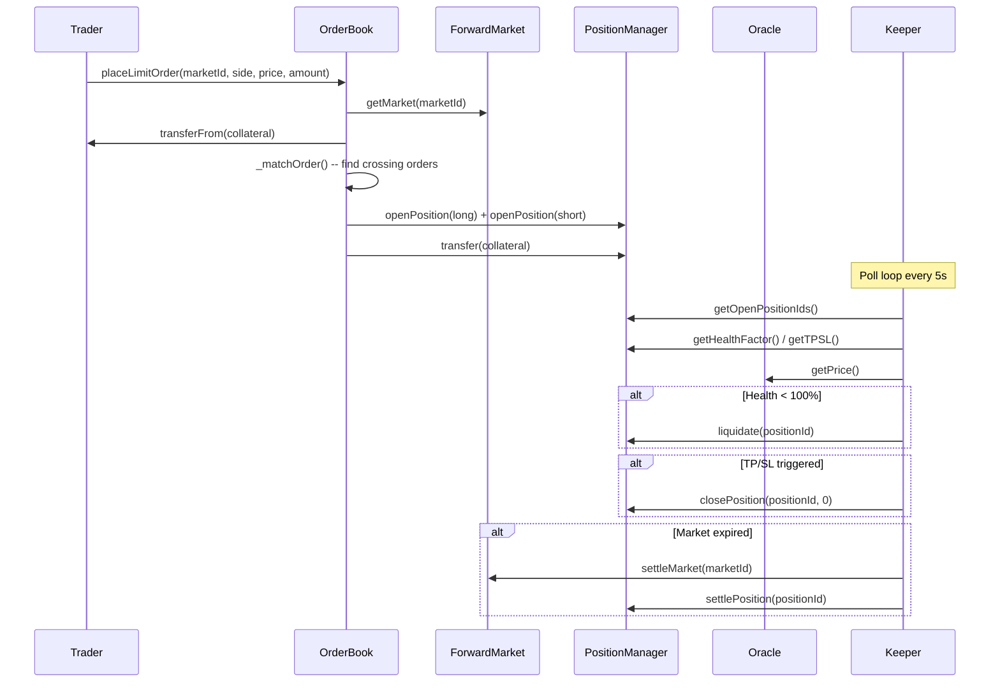
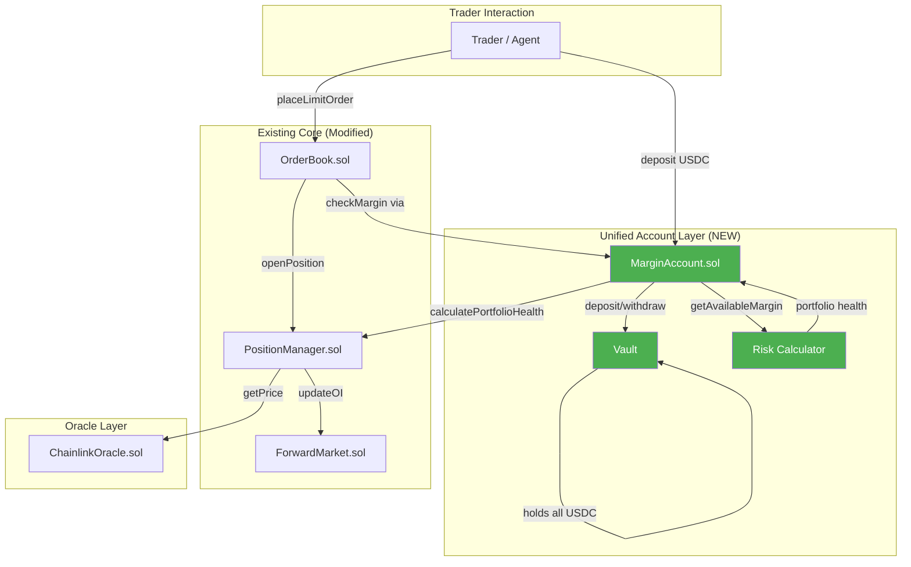
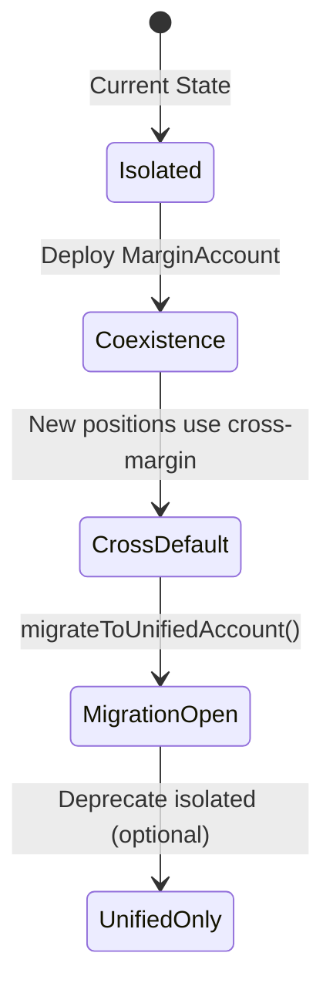
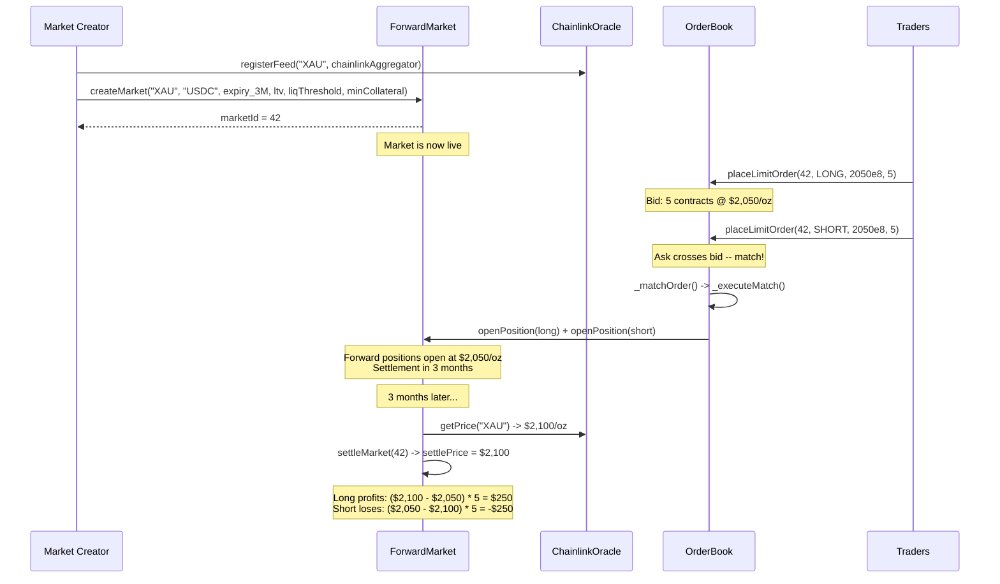
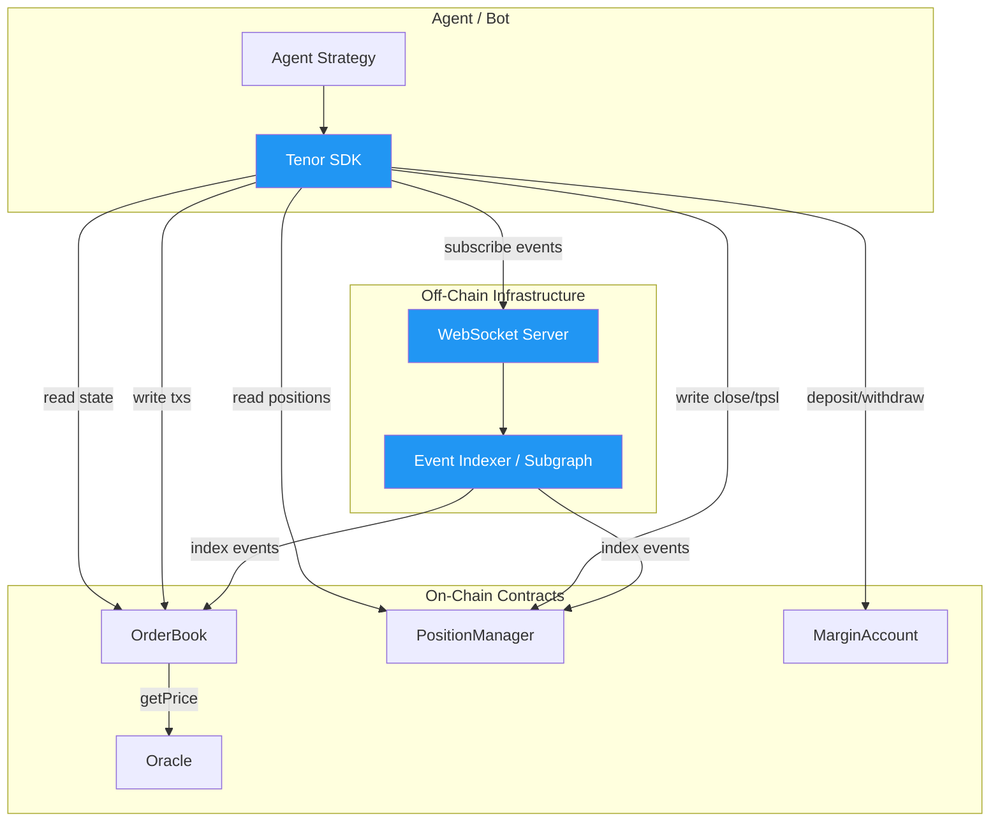
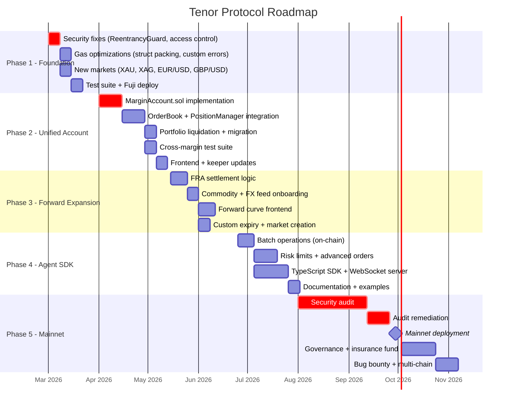
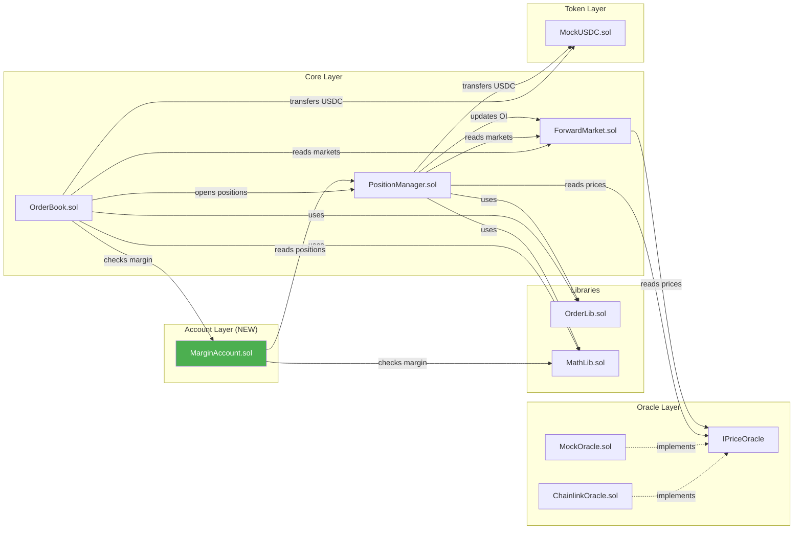

# Tenor Protocol -- Improvements Specification

> **Version**: 1.0
> **Date**: 2026-02-22
> **Branch**: `feat/improvements-spec`
> **Status**: Draft / RFC

---

## Table of Contents

1. [Executive Summary](#1-executive-summary)
2. [Current Architecture Review](#2-current-architecture-review)
3. [Part 1 -- Unified Account (Hyperliquid-Style)](#3-part-1--unified-account-hyperliquid-style)
4. [Part 2 -- Classical Forwards (Tenor as THE Forward Hub)](#4-part-2--classical-forwards-tenor-as-the-forward-hub)
5. [Part 3 -- Agent Trader Features](#5-part-3--agent-trader-features)
6. [Part 4 -- Technical Improvements](#6-part-4--technical-improvements)
7. [Part 5 -- Roadmap](#7-part-5--roadmap)

---

## 1. Executive Summary

Tenor Protocol is an on-chain Non-Deliverable Forward (NDF) DEX deployed on Avalanche Fuji. It allows traders to take long or short forward positions on crypto assets (ETH, BTC, AVAX) with collateralized margin, a CLOB-style order book, and automated settlement via Chainlink oracles.

This document proposes five categories of improvements to transform Tenor from a testnet prototype into a production-grade forward-market protocol:

1. **Unified Account** -- Cross-margin, portfolio-level risk management (inspired by Hyperliquid)
2. **Classical Forwards Expansion** -- Commodities, FX, interest rates, custom expiries
3. **Agent Trader Features** -- SDK, batch operations, streaming events for AI/bot traders
4. **Technical Improvements** -- Gas optimization, security hardening, UX upgrades
5. **Phased Roadmap** -- From current state to mainnet with audit and governance

---

## 2. Current Architecture Review

### 2.1 Contract Layout

```
contracts/src/
  core/
    ForwardMarket.sol   -- Market lifecycle (create, settle, OI tracking)
    OrderBook.sol       -- CLOB with limit/market orders, matching engine
    PositionManager.sol -- Position lifecycle, TP/SL, liquidation, settlement
  oracle/
    PriceOracle.sol     -- IPriceOracle interface
    ChainlinkOracle.sol -- Production oracle (Chainlink feeds + fallback)
    MockOracle.sol      -- Test oracle with manual price setting
  libraries/
    OrderLib.sol        -- Shared structs (Order, PositionInfo, MarketInfo, TPSLOrder)
    MathLib.sol         -- PnL calculation, health factor, precision constants
  tokens/
    MockUSDC.sol        -- Test collateral (6 decimals)
    MockWETH.sol        -- Test wrapped ETH
```

### 2.2 Current Data Flow



### 2.3 Key Design Characteristics

| Feature | Current Implementation | Limitation |
|---------|----------------------|------------|
| **Margin model** | Isolated per position | Capital inefficient; no netting |
| **Collateral** | USDC only (6 decimals) | Single collateral type |
| **Price precision** | 8 decimals (Chainlink standard) | Good |
| **Order matching** | Linear scan of opposite side array | O(n) per match; no sorting |
| **Position close** | Against protocol pool (mark price) | Not peer-to-peer; protocol bears risk |
| **Access control** | Simple `onlyOwner` + `authorized` mapping | No role-based AC |
| **Asset types** | Crypto only (ETH, BTC, AVAX) | No commodities, FX, rates |
| **Order types** | Limit + Market | No stop-limit, trailing, IOC, FOK, GTC |

### 2.4 Identified Issues

1. **No access control on `updateOI`** -- The `authorized` mapping exists but is never checked in `updateOI()`. Anyone can call it.
2. **No access control on `createMarket`** -- Any address can create markets; should be restricted.
3. **Unchecked `transferFrom` return value** -- `collateralToken.transferFrom()` does not check return value (though OpenZeppelin ERC20 reverts on failure, non-standard tokens may not).
4. **`closePosition` pays from protocol pool** -- When a trader closes early, their PnL is paid from the `PositionManager` balance, not the counterparty. This creates a fund solvency risk.
5. **Order book arrays grow unboundedly** -- `bidOrderIds` and `askOrderIds` are never cleaned of filled/cancelled orders proactively during reads.
6. **`getActiveMarkets()` is O(n)** -- Iterates all markets twice; will not scale.
7. **No reentrancy guard** -- No `nonReentrant` modifier on functions that transfer tokens.
8. **No event indexing on key fields** -- Some events lack indexed parameters needed for efficient subgraph indexing.

---

## 3. Part 1 -- Unified Account (Hyperliquid-Style)

### 3.1 Background: How Hyperliquid Does It

Hyperliquid's margin system operates on three tiers:

1. **Isolated margin** -- Each position has its own collateral. Liquidation of one position does not affect others.
2. **Cross margin** (default) -- A single balance collateralizes ALL cross-margin positions. Unrealized PnL from one position can offset margin requirements of another.
3. **Portfolio margin** (advanced) -- Unifies spot and perpetual accounts. Calculates margin based on net portfolio risk. Offsets between correlated positions reduce margin requirements.

Key properties of Hyperliquid's unified account:
- Single deposit, single withdrawal -- no per-position collateral management
- Unrealized PnL from profitable positions increases available margin
- Liquidation triggers only when the entire account equity falls below the portfolio maintenance margin
- Automatic yield on idle collateral
- Cross-margining between spot and derivatives

### 3.2 Current Tenor Model (Isolated Margin)

```
Trader Account
  |
  +-- Position #1 (ETH LONG)  --> Collateral: $5,000  (locked)
  +-- Position #2 (BTC SHORT) --> Collateral: $8,000  (locked)
  +-- Position #3 (AVAX LONG) --> Collateral: $2,000  (locked)
  |
  Total locked: $15,000
  Available: $0 (all capital is locked per-position)
```

**Problem**: If Position #1 is in profit by $3,000 and Position #3 is about to be liquidated with only $200 margin remaining, the trader cannot use Position #1's unrealized profit to save Position #3. Each position lives in isolation.

### 3.3 Proposed Tenor Model (Unified Account)

```
Trader Margin Account (MarginAccount.sol)
  |
  +-- Deposited Balance: $15,000
  +-- Unrealized PnL:
  |     Position #1 (ETH LONG):   +$3,000
  |     Position #2 (BTC SHORT):  -$500
  |     Position #3 (AVAX LONG):  -$1,800
  |
  +-- Total Equity: $15,000 + $3,000 - $500 - $1,800 = $15,700
  +-- Total Margin Required: $4,500
  +-- Available Margin: $15,700 - $4,500 = $11,200
```

### 3.4 Architecture Diagram



### 3.5 `MarginAccount.sol` Specification

```solidity
// SPDX-License-Identifier: MIT
pragma solidity ^0.8.24;

/// @title MarginAccount
/// @notice Unified margin account for cross-margin trading on Tenor Protocol.
///         Each trader has one account that collateralizes all their positions.
interface IMarginAccount {
    // ---- Events ----
    event Deposit(address indexed trader, uint256 amount);
    event Withdraw(address indexed trader, uint256 amount);
    event MarginReserved(address indexed trader, uint256 positionId, uint256 amount);
    event MarginReleased(address indexed trader, uint256 positionId, uint256 amount);
    event AccountLiquidated(address indexed trader, address indexed liquidator);

    // ---- Core Functions ----

    /// @notice Deposit USDC into the trader's margin account.
    /// @param amount Amount of USDC (6 decimals) to deposit.
    function deposit(uint256 amount) external;

    /// @notice Withdraw USDC from the margin account.
    /// @dev Reverts if withdrawal would bring account below maintenance margin.
    /// @param amount Amount of USDC (6 decimals) to withdraw.
    function withdraw(uint256 amount) external;

    // ---- Margin Queries ----

    /// @notice Get the total deposited balance (does not include unrealized PnL).
    function getBalance(address trader) external view returns (uint256);

    /// @notice Get the total equity (balance + sum of all unrealized PnL).
    /// @dev Equity = deposited_balance + SUM(unrealized_pnl_i) for all open positions.
    function getEquity(address trader) external view returns (int256);

    /// @notice Get the total initial margin required across all open positions.
    /// @dev IM = SUM(position_size_i * entry_price_i / ltv_i) for all positions.
    function getTotalInitialMargin(address trader) external view returns (uint256);

    /// @notice Get the total maintenance margin required.
    /// @dev MM = SUM(position_size_i * entry_price_i * liq_threshold_i) for all positions.
    function getTotalMaintenanceMargin(address trader) external view returns (uint256);

    /// @notice Get the available margin for opening new positions.
    /// @dev Available = max(0, equity - total_initial_margin)
    function getAvailableMargin(address trader) external view returns (uint256);

    /// @notice Calculate the portfolio health factor.
    /// @dev Health = equity / maintenance_margin. < 1.0 means liquidatable.
    /// @return Health factor in basis points (10000 = 100% = minimum healthy).
    function calculatePortfolioHealth(address trader) external view returns (uint256);

    // ---- Account Liquidation ----

    /// @notice Liquidate an entire account when portfolio health < 100%.
    /// @dev Closes all positions at mark price. Liquidator receives bonus.
    ///      Remaining equity (if any) is returned to the trader.
    function liquidateAccount(address trader) external;

    // ---- Internal (called by OrderBook/PositionManager) ----

    /// @notice Reserve margin when a new position is opened.
    function reserveMargin(address trader, uint256 positionId, uint256 initialMargin) external;

    /// @notice Release margin when a position is closed or settled.
    function releaseMargin(address trader, uint256 positionId) external;
}
```

### 3.6 Margin Calculation Details

```
For each position i:
  unrealized_pnl_i = (mark_price - entry_price) * size * (isLong ? 1 : -1) * COLLATERAL_PRECISION / PRICE_PRECISION
  initial_margin_i = size * entry_price * COLLATERAL_PRECISION * PERCENT_BASE / (PRICE_PRECISION * ltv)
  maintenance_margin_i = size * entry_price * liq_threshold * COLLATERAL_PRECISION / (PRICE_PRECISION * PERCENT_BASE)

Portfolio level:
  equity = deposited_balance + SUM(unrealized_pnl_i)
  total_initial_margin = SUM(initial_margin_i)
  total_maintenance_margin = SUM(maintenance_margin_i)
  available_margin = max(0, equity - total_initial_margin)
  health_factor = equity * PERCENT_BASE / total_maintenance_margin
```

### 3.7 How Liquidation Changes

| Aspect | Isolated (Current) | Cross-Margin (Proposed) |
|--------|-------------------|------------------------|
| **Trigger** | Single position health < 100% | Portfolio health < 100% |
| **Scope** | Only the unhealthy position | All positions in the account |
| **Profitable positions** | Cannot offset losses | Unrealized profit offsets losses |
| **Liquidator action** | `liquidate(positionId)` | `liquidateAccount(trader)` |
| **Partial liquidation** | Not supported | Close positions until health restored |
| **Bonus** | 5% of position collateral | 5% of account shortfall |

### 3.8 Migration Path

The migration from isolated to unified accounts should be backward-compatible:

1. **Phase A**: Deploy `MarginAccount.sol` alongside existing contracts. Both modes coexist.
2. **Phase B**: New positions default to cross-margin via `MarginAccount`. Traders can opt in.
3. **Phase C**: Existing isolated positions can be migrated by calling `migrateToUnifiedAccount()`, which:
   - Closes the isolated position at mark price
   - Deposits the collateral into the unified account
   - Re-opens the position under the unified account
4. **Phase D**: Deprecate isolated margin (optional; some traders prefer it for risk isolation).



---

## 4. Part 2 -- Classical Forwards (Tenor as THE Forward Hub)

### 4.1 What Are Classical Forwards?

A forward contract is a binding agreement between two parties to buy or sell an asset at a specified price on a specified future date. Unlike futures (standardized, exchange-traded), forwards are traditionally OTC instruments with customizable terms.

**Key characteristics:**
- Fixed delivery date
- Fixed price locked at inception
- No daily mark-to-market settlement (unlike futures)
- Counterparty risk (mitigated on-chain via collateral)
- Cash-settled (NDF) or physically settled

Tenor already implements the NDF (Non-Deliverable Forward) model -- cash settlement at expiry based on the difference between the agreed forward price and the settlement price from an oracle. This is the perfect foundation for expanding into classical forward asset classes.

### 4.2 Asset Class Expansion

#### 4.2.1 Commodity Forwards

| Asset | Chainlink Feed | Pair | Use Case |
|-------|---------------|------|----------|
| Gold (XAU) | XAU/USD | XAU/USDC | Inflation hedge, portfolio diversification |
| Silver (XAG) | XAG/USD | XAG/USDC | Industrial + precious metal exposure |
| Crude Oil (WTI) | WTI/USD | OIL/USDC | Energy sector speculation |
| Natural Gas | -- | GAS/USDC | Seasonal energy trading |

**Implementation**: Register Chainlink commodity price feeds in `ChainlinkOracle.sol`:

```solidity
// Example: Register gold feed on Avalanche mainnet
oracle.registerFeed("XAU", 0x...); // Chainlink XAU/USD aggregator
oracle.registerFeed("XAG", 0x...); // Chainlink XAG/USD aggregator
```

Then create markets:

```solidity
forwardMarket.createMarket(
    "XAU",           // baseAsset
    "USDC",          // quoteAsset
    expiration,      // e.g., 3 months from now
    3000,            // 30% LTV (commodities are volatile)
    7000,            // 70% liquidation threshold
    100e6            // $100 min collateral
);
```

#### 4.2.2 FX Forwards

| Pair | Chainlink Feed | Use Case |
|------|---------------|----------|
| EUR/USD | EUR/USD | Eurozone FX hedging |
| GBP/USD | GBP/USD | Sterling exposure |
| JPY/USD | JPY/USD | Yen carry trade |
| CHF/USD | CHF/USD | Safe-haven currency |
| AUD/USD | AUD/USD | Commodity currency |

FX forwards are the largest derivatives market globally (~$100T notional). On-chain FX forwards via Tenor would enable:

- **Permissionless hedging** for businesses with cross-border payments
- **Carry trade strategies** (borrow low-yield currency, invest in high-yield)
- **Emerging market currencies** where traditional FX forwards are expensive or unavailable

**Price precision consideration**: FX rates like EUR/USD (1.0850) need more decimal precision than crypto. Chainlink provides 8 decimals, which gives precision to 0.00000001 -- sufficient for most FX pairs.

#### 4.2.3 Interest Rate Forwards (FRA-Like)

A Forward Rate Agreement (FRA) locks in an interest rate for a future period. On-chain implementation:

| Product | Reference Rate | Use Case |
|---------|---------------|----------|
| SOFR Forward | Chainlink SOFR feed | USD rate hedging |
| ETH Staking Yield | Lido stETH rate | Yield curve trading |
| DeFi Rate Forward | Aave/Compound rate | DeFi yield hedging |

**Design note**: Interest rate forwards require a different settlement mechanism. Instead of `settlePrice - entryPrice`, the payoff is:

```
Payoff = Notional * (Reference_Rate - Forward_Rate) * DayCountFraction
```

This would require a new `ForwardType` enum in `MarketInfo`:

```solidity
enum ForwardType {
    ASSET_FORWARD,      // Standard NDF: settles on price difference
    INTEREST_RATE_FRA   // FRA: settles on rate difference * notional * DCF
}
```

### 4.3 Custom Expiry Dates

**Current limitation**: Markets are created by the protocol owner with fixed expiration timestamps.

**Proposed enhancement**: Allow market creators (permissioned or permissionless) to set any expiry date, enabling a full forward curve:

```solidity
function createMarketWithExpiry(
    string calldata baseAsset,
    string calldata quoteAsset,
    uint256 expiration,        // Any future timestamp
    uint256 ltv,
    uint256 liquidationThreshold,
    uint256 minCollateral,
    ForwardType forwardType,   // NEW: asset vs. rate forward
    uint256 notionalMultiplier // NEW: for FRA payoff calculation
) external returns (uint256 marketId);
```

### 4.4 Forward Curves (Term Structure Display)

A forward curve shows the forward price for different maturities of the same underlying asset. For example:

```
ETH Forward Curve (as of 2026-02-22):

  Spot:  $2,500.00
  1W:    $2,502.50  (+0.10%)
  1M:    $2,512.00  (+0.48%)
  3M:    $2,540.00  (+1.60%)
  6M:    $2,580.00  (+3.20%)
  1Y:    $2,650.00  (+6.00%)
```

**Implementation**: The frontend queries all active markets for the same `baseAsset`, sorted by expiration, and plots the term structure. The smart contracts already support this -- we just need:

1. Multiple markets per asset with different expiries (already possible)
2. A view function to query markets by asset:

```solidity
function getMarketsByAsset(string calldata baseAsset)
    external view returns (MarketInfo[] memory);
```

3. Frontend charting of the forward curve using best bid/ask midpoint per maturity.

### 4.5 Market Creation Flow



### 4.6 Supported Chainlink Feeds Summary

Based on Chainlink's current feed availability:

| Category | Assets | Chainlink Status | Priority |
|----------|--------|-----------------|----------|
| Crypto | ETH, BTC, AVAX, SOL, LINK | Available on most chains | Already supported |
| Precious Metals | XAU, XAG | Available (XAU/USD, XAG/USD) | High |
| Energy | WTI Crude Oil | Available (WTI/USD) | Medium |
| FX Majors | EUR/USD, GBP/USD, JPY/USD | Available on Ethereum, expanding | High |
| FX Minors | AUD/USD, CHF/USD, CAD/USD | Available on Ethereum | Medium |
| Rates | SOFR, stETH rate | Limited availability | Low (Phase 3+) |

---

## 5. Part 3 -- Agent Trader Features

### 5.1 What Would an AI Agent Need?

AI agents and trading bots are increasingly active in DeFi. For Tenor to attract automated traders, it needs to provide:

1. **Efficient data access** -- Real-time prices, order book state, position data
2. **Atomic operations** -- Batch order placement, portfolio rebalancing
3. **Risk management primitives** -- Max position size, drawdown limits
4. **Event-driven architecture** -- React to fills, liquidations, price changes
5. **Composability** -- Integrate with other DeFi protocols

### 5.2 Streaming Prices API

**On-chain**: Agents can subscribe to Chainlink price feed update events or poll the oracle.

**Off-chain (recommended)**: Provide a WebSocket API in the keeper/indexer layer:

```typescript
// Agent SDK -- WebSocket price stream
const tenor = new TenorSDK({ rpcUrl, wsUrl });

tenor.onPriceUpdate("ETH", (price, timestamp) => {
  console.log(`ETH: $${price} @ ${timestamp}`);
});

tenor.onOrderBookUpdate(marketId, (bids, asks) => {
  const bestBid = bids[0]?.price;
  const bestAsk = asks[0]?.price;
  console.log(`Spread: ${bestAsk - bestBid}`);
});
```

**On-chain events to emit** (additions to current contracts):

```solidity
// In ChainlinkOracle.sol
event PriceFetched(string indexed asset, uint256 price, uint256 timestamp);

// In OrderBook.sol
event OrderBookUpdated(uint256 indexed marketId, uint256 bestBid, uint256 bestAsk, uint256 bidDepth, uint256 askDepth);
```

### 5.3 Batch Operations

**Problem**: Currently, placing 10 orders requires 10 separate transactions.

**Solution**: Add batch functions to `OrderBook.sol`:

```solidity
/// @notice Place multiple limit orders atomically in a single transaction.
/// @param orders Array of order parameters.
/// @return orderIds Array of created order IDs.
function batchPlaceLimitOrders(
    BatchOrderParams[] calldata orders
) external returns (uint256[] memory orderIds);

struct BatchOrderParams {
    uint256 marketId;
    OrderLib.Side side;
    uint256 price;
    uint256 amount;
}

/// @notice Cancel multiple orders atomically.
function batchCancelOrders(uint256[] calldata orderIds) external;

/// @notice Place orders and cancel others atomically (replace orders).
function batchReplaceOrders(
    uint256[] calldata cancelIds,
    BatchOrderParams[] calldata newOrders
) external returns (uint256[] memory newOrderIds);
```

### 5.4 Portfolio Rebalancing

Enable agents to express complex portfolio operations in a single transaction:

```solidity
/// @notice Close multiple positions and open new ones atomically.
/// @dev Useful for rebalancing a portfolio without intermediate margin requirements.
function rebalancePortfolio(
    uint256[] calldata closePositionIds,
    uint256[] calldata closeSizes,       // 0 = full close
    BatchOrderParams[] calldata newOrders
) external returns (uint256[] memory newOrderIds);
```

### 5.5 Risk Limits

On-chain enforceable risk limits per trader account:

```solidity
struct RiskLimits {
    uint256 maxPositionSize;     // Max contracts per position (0 = unlimited)
    uint256 maxTotalExposure;    // Max total notional across all positions
    uint256 maxDrawdownBps;      // Max drawdown in bps before auto-close (0 = disabled)
    uint256 maxLeverage;         // Max effective leverage (0 = unlimited)
    uint256 maxOpenOrders;       // Max concurrent open orders
}

/// @notice Set risk limits for the caller's account.
function setRiskLimits(RiskLimits calldata limits) external;

/// @notice Check if an order would violate risk limits.
function checkRiskLimits(address trader, uint256 marketId, OrderLib.Side side, uint256 price, uint256 amount)
    external view returns (bool allowed, string memory reason);
```

### 5.6 Event Subscriptions

Rich event emission for agent consumption:

```solidity
// Position lifecycle events (enhance existing)
event PositionOpened(
    uint256 indexed positionId,
    address indexed trader,
    uint256 indexed marketId,
    OrderLib.Side side,
    uint256 entryPrice,
    uint256 size,
    uint256 collateral,
    uint256 orderId          // NEW: link back to the order that created it
);

event PositionPnLSnapshot(
    uint256 indexed positionId,
    int256 unrealizedPnL,
    uint256 markPrice,
    uint256 healthFactor
);

// Order lifecycle events (enhance existing)
event OrderFilled(
    uint256 indexed orderId,
    uint256 filledAmount,
    uint256 fillPrice,
    uint256 remainingAmount
);

// Market events
event MarketOIUpdated(
    uint256 indexed marketId,
    uint256 totalLongOI,
    uint256 totalShortOI
);
```

### 5.7 Grid Trading Support

Grid trading places buy and sell orders at regular price intervals above and below the current price. Agent SDK support:

```typescript
// Agent SDK -- Grid trading helper
const grid = tenor.createGrid({
  marketId: 1,
  centerPrice: 2500,
  gridSpacing: 50,       // $50 between each level
  levels: 10,            // 5 above, 5 below center
  amountPerLevel: 2,     // 2 contracts per grid level
  side: "both",          // Buy below center, sell above
});

await grid.deploy();     // Places 10 limit orders atomically via batchPlaceLimitOrders
grid.onFill((fill) => {  // When a grid level fills, place the opposite order
  grid.replaceLevel(fill.level);
});
```

On-chain, this is implemented purely through `batchPlaceLimitOrders` and event-driven replacement -- no new contract logic needed.

### 5.8 DCA Support (Time-Weighted Execution)

Dollar-Cost Averaging splits a large order into smaller chunks executed over time:

```typescript
// Agent SDK -- DCA execution
const dca = tenor.createDCA({
  marketId: 1,
  side: "LONG",
  totalAmount: 100,      // 100 contracts total
  chunks: 10,            // 10 orders of 10 contracts each
  interval: 3600,        // 1 hour between each chunk
  orderType: "market",   // or "limit" with slippage tolerance
  maxSlippageBps: 50,    // 0.5% max slippage per chunk
});

await dca.start();
```

This is an off-chain strategy pattern (keeper/agent-side), not an on-chain feature. The SDK handles scheduling and execution.

### 5.9 Agent SDK Architecture



---

## 6. Part 4 -- Technical Improvements

### 6.1 Gas Optimizations

#### 6.1.1 Struct Packing

**Current `OrderLib.Order` struct** (10 slots = ~200k gas to write):

```solidity
struct Order {
    uint256 id;          // slot 0 (32 bytes)
    address trader;      // slot 1 (20 bytes) -- 12 bytes wasted
    uint256 marketId;    // slot 2
    Side side;           // slot 3 (1 byte) -- 31 bytes wasted
    uint256 price;       // slot 4
    uint256 amount;      // slot 5
    uint256 filled;      // slot 6
    uint256 collateral;  // slot 7
    uint256 timestamp;   // slot 8
    OrderStatus status;  // slot 9 (1 byte) -- 31 bytes wasted
}
```

**Optimized struct** (7 slots, ~30% gas savings on writes):

```solidity
struct Order {
    uint256 id;          // slot 0
    address trader;      // slot 1: 20 bytes
    Side side;           //       + 1 byte
    OrderStatus status;  //       + 1 byte
    uint32 marketId;     //       + 4 bytes
    uint48 timestamp;    //       + 6 bytes  (enough until year 8.9M)
    uint256 price;       // slot 2
    uint256 amount;      // slot 3
    uint256 filled;      // slot 4
    uint256 collateral;  // slot 5
}
```

Similarly, **`PositionInfo`** can be packed:

```solidity
struct PositionInfo {
    uint256 id;          // slot 0
    address trader;      // slot 1: 20 bytes
    Side side;           //       + 1 byte
    bool isOpen;         //       + 1 byte
    uint32 marketId;     //       + 4 bytes
    uint48 timestamp;    //       + 6 bytes
    uint256 entryPrice;  // slot 2
    uint256 size;        // slot 3
    uint256 collateral;  // slot 4
}
```

Savings: 5 slots -> 4 slots per position = **~20% gas reduction** on position operations.

#### 6.1.2 Batch Operations

Already covered in Part 3 (Agent Features). Batch order placement saves ~21,000 gas per order in base transaction costs alone.

#### 6.1.3 Order Book Sorting

**Current**: Linear scan to find matching orders -- O(n) per match.

**Proposed**: Maintain sorted order arrays (insertion sort on placement) or use a Red-Black tree library. This changes matching from O(n) to O(log n) for finding the best price and O(1) for checking if a match exists.

For a simpler approach, keep arrays sorted by price (descending for bids, ascending for asks) and break early when no more crosses are possible:

```solidity
function _matchOrder(uint256 incomingOrderId) internal {
    // ... existing code ...
    // Since oppositeIds is sorted, we can break early:
    if (isLong ? incoming.price < resting.price : incoming.price > resting.price) {
        break; // No more crosses possible (sorted order)
    }
}
```

#### 6.1.4 Storage vs. Memory for View Functions

Several view functions copy entire arrays from storage to memory unnecessarily. Use pagination where possible (already done for `getOpenPositionIds` but not for `getOrderBook`, `getUserOrders`, `getActiveMarkets`).

### 6.2 Security Improvements

#### 6.2.1 Reentrancy Protection

**Issue**: `OrderBook.placeLimitOrder()`, `PositionManager.closePosition()`, `PositionManager.liquidate()`, and `PositionManager.settlePosition()` all perform external token transfers followed by state changes.

**Fix**: Add OpenZeppelin's `ReentrancyGuard`:

```solidity
import {ReentrancyGuard} from "@openzeppelin/contracts/utils/ReentrancyGuard.sol";

contract OrderBook is ReentrancyGuard {
    function placeLimitOrder(...) external nonReentrant { ... }
    function placeMarketOrder(...) external nonReentrant { ... }
    function cancelOrder(...) external nonReentrant { ... }
}

contract PositionManager is ReentrancyGuard {
    function closePosition(...) external nonReentrant { ... }
    function liquidate(...) external nonReentrant { ... }
    function settlePosition(...) external nonReentrant { ... }
    function addCollateral(...) external nonReentrant { ... }
    function removeCollateral(...) external nonReentrant { ... }
}
```

#### 6.2.2 Access Control on `updateOI`

**Issue**: `ForwardMarket.updateOI()` can be called by anyone. The `authorized` mapping exists but is never checked.

**Fix**:

```solidity
function updateOI(uint256 marketId, OrderLib.Side side, uint256 amount, bool isIncrease) external {
    require(authorized[msg.sender], "ForwardMarket: not authorized");
    // ... existing logic ...
}
```

#### 6.2.3 Access Control on `createMarket`

**Issue**: Any address can call `createMarket()`.

**Fix**: Add `onlyOwner` modifier or a permissioned `MARKET_CREATOR_ROLE`:

```solidity
function createMarket(...) external onlyOwner returns (uint256 marketId) { ... }
```

Or with OpenZeppelin AccessControl for more granular control:

```solidity
bytes32 public constant MARKET_CREATOR_ROLE = keccak256("MARKET_CREATOR_ROLE");

function createMarket(...) external onlyRole(MARKET_CREATOR_ROLE) returns (uint256 marketId) { ... }
```

#### 6.2.4 SafeERC20 for Token Transfers

**Issue**: `collateralToken.transferFrom()` and `collateralToken.transfer()` assume the token reverts on failure. Some tokens (USDT, for example) return `false` instead.

**Fix**: Use OpenZeppelin's `SafeERC20`:

```solidity
import {SafeERC20} from "@openzeppelin/contracts/token/ERC20/utils/SafeERC20.sol";

using SafeERC20 for IERC20;

// Replace:
collateralToken.transferFrom(msg.sender, address(this), collateral);
// With:
collateralToken.safeTransferFrom(msg.sender, address(this), collateral);
```

#### 6.2.5 Oracle Manipulation Protection

**Issue**: The oracle price is read once and used directly. A flash-loan attacker could manipulate Chainlink feeds (unlikely with Chainlink but possible with other oracles) or exploit stale prices.

**Fixes**:

1. **Staleness check**: Reject prices older than a threshold:

```solidity
(uint256 price, uint256 timestamp) = oracle.getPrice(asset);
require(block.timestamp - timestamp <= MAX_PRICE_AGE, "Oracle: stale price");
```

2. **Price deviation check**: Reject prices that deviate too much from the last known price:

```solidity
uint256 lastPrice = lastKnownPrices[asset];
if (lastPrice > 0) {
    uint256 deviation = price > lastPrice
        ? (price - lastPrice) * 10000 / lastPrice
        : (lastPrice - price) * 10000 / lastPrice;
    require(deviation <= MAX_PRICE_DEVIATION_BPS, "Oracle: price deviation too high");
}
lastKnownPrices[asset] = price;
```

3. **TWAP**: Use a time-weighted average price instead of the spot price for liquidation decisions.

#### 6.2.6 Solvency of `PositionManager` for Early Closes

**Issue**: When a trader closes a position early at profit, the PnL is paid from `PositionManager`'s USDC balance. If the counterparty also closes at profit (different market), the contract may not have enough funds.

**Current mitigation**: `if (payout > balance) payout = balance;` -- this silently caps the payout, which is unfair.

**Fix**: The counterparty's collateral should be the source of PnL payout. With the unified account model, this becomes more structured:

- Long closes at profit -> Short counterparty's margin account is debited
- If the counterparty cannot cover the PnL -> the counterparty is liquidated

For the current isolated model, a simpler fix is to ensure the protocol always holds enough collateral by locking both sides' collateral on match and only releasing it on settlement.

### 6.3 UX Improvements

#### 6.3.1 Better Error Messages

Current error strings are functional but could be more descriptive. Add error codes and details:

```solidity
// Instead of:
require(collateral >= market.minCollateral, "OrderBook: below min collateral");

// Use custom errors (cheaper in gas too):
error InsufficientCollateral(uint256 provided, uint256 required, uint256 marketId);

if (collateral < market.minCollateral) {
    revert InsufficientCollateral(collateral, market.minCollateral, marketId);
}
```

Custom errors save ~200 gas compared to string require messages and provide structured data to frontends.

#### 6.3.2 Gas Estimation Helpers

Add view functions that help frontends estimate gas costs before submitting transactions:

```solidity
/// @notice Estimate the collateral required for a limit order.
function estimateCollateral(uint256 marketId, uint256 price, uint256 amount)
    external view returns (uint256 collateral);

/// @notice Preview the PnL for closing a position at the current mark price.
function previewClose(uint256 positionId, uint256 closeSize)
    external view returns (int256 pnl, uint256 payout);
```

#### 6.3.3 Order Expiry (Time-in-Force)

Add order expiry support:

```solidity
enum TimeInForce {
    GTC,     // Good Till Cancelled (current behavior)
    IOC,     // Immediate Or Cancel (fill what you can, cancel rest)
    FOK,     // Fill Or Kill (all or nothing)
    GTD      // Good Till Date (expires at timestamp)
}
```

### 6.4 Performance and Indexing

#### 6.4.1 Subgraph / Indexer Design

Deploy a subgraph (The Graph) or custom indexer for efficient querying:

```graphql
type Market @entity {
  id: ID!
  baseAsset: String!
  quoteAsset: String!
  expiration: BigInt!
  settled: Boolean!
  totalLongOI: BigInt!
  totalShortOI: BigInt!
  orders: [Order!]! @derivedFrom(field: "market")
  positions: [Position!]! @derivedFrom(field: "market")
}

type Order @entity {
  id: ID!
  trader: Bytes!
  market: Market!
  side: String!
  price: BigInt!
  amount: BigInt!
  filled: BigInt!
  status: String!
  timestamp: BigInt!
  fills: [Fill!]! @derivedFrom(field: "order")
}

type Position @entity {
  id: ID!
  trader: Bytes!
  market: Market!
  side: String!
  entryPrice: BigInt!
  size: BigInt!
  collateral: BigInt!
  isOpen: Boolean!
  timestamp: BigInt!
  tpsl: TPSL
}
```

#### 6.4.2 Event Enrichment

Current events are missing some indexed fields. Add indexing for efficient filtering:

```solidity
// Enhanced events
event OrderPlaced(
    uint256 indexed orderId,
    address indexed trader,
    uint256 indexed marketId,
    OrderLib.Side side,
    uint256 price,
    uint256 amount,
    uint256 collateral,
    OrderLib.TimeInForce timeInForce  // NEW
);

event PositionOpened(
    uint256 indexed positionId,
    address indexed trader,
    uint256 indexed marketId,
    OrderLib.Side side,
    uint256 entryPrice,
    uint256 size,
    uint256 collateral,
    uint256 matchOrderId   // NEW: link to the order
);
```

---

## 7. Part 5 -- Roadmap

### Phase 1: Foundation (Weeks 1-4)

**Goal**: Fix critical issues, optimize gas, expand markets.

| Task | Priority | Effort |
|------|----------|--------|
| Add `ReentrancyGuard` to OrderBook + PositionManager | Critical | 1 day |
| Fix `updateOI` access control (check `authorized`) | Critical | 1 hour |
| Add `onlyOwner` to `createMarket` | Critical | 1 hour |
| Use `SafeERC20` for all token transfers | Critical | 2 hours |
| Add oracle staleness check | High | 2 hours |
| Pack structs (Order, PositionInfo) | Medium | 1 day |
| Switch to custom errors | Medium | 1 day |
| Add `estimateCollateral` + `previewClose` view functions | Medium | 4 hours |
| Add Chainlink feeds for XAU, XAG, EUR/USD, GBP/USD | Medium | 1 day |
| Create markets for commodities + FX | Medium | 2 hours |
| Write comprehensive test suite for new markets | Medium | 2 days |
| Deploy updated contracts to Fuji testnet | Medium | 1 day |

### Phase 2: Unified Account + Cross-Margin (Weeks 5-10)

**Goal**: Deploy `MarginAccount.sol` and migrate to cross-margin.

| Task | Priority | Effort |
|------|----------|--------|
| Implement `MarginAccount.sol` | High | 2 weeks |
| Modify `OrderBook` to check margin via `MarginAccount` | High | 1 week |
| Modify `PositionManager` to use `MarginAccount` for payouts | High | 1 week |
| Portfolio-level liquidation in `MarginAccount` | High | 3 days |
| Add `migrateToUnifiedAccount()` function | Medium | 2 days |
| Write test suite for cross-margin scenarios | High | 1 week |
| Update keeper bot for portfolio-level liquidation | Medium | 3 days |
| Update frontend for unified account UX | Medium | 1 week |

### Phase 3: Classical Forwards Expansion (Weeks 11-16)

**Goal**: Become THE on-chain forward hub.

| Task | Priority | Effort |
|------|----------|--------|
| Add `ForwardType` enum (asset vs. rate) | High | 2 days |
| Implement FRA settlement logic | High | 1 week |
| Add `getMarketsByAsset` view function | Medium | 2 hours |
| Build forward curve display in frontend | Medium | 1 week |
| Onboard commodity feeds (XAU, XAG, WTI) | High | 2 days |
| Onboard FX feeds (EUR, GBP, JPY, CHF) | High | 2 days |
| Custom expiry date creation | Medium | 3 days |
| Rate forward prototype (SOFR/stETH) | Low | 2 weeks |
| Market-maker incentive program design | Medium | 1 week |

### Phase 4: Agent SDK + Advanced Orders (Weeks 17-22)

**Goal**: Make Tenor the most agent-friendly derivatives protocol.

| Task | Priority | Effort |
|------|----------|--------|
| `batchPlaceLimitOrders` + `batchCancelOrders` | High | 3 days |
| `batchReplaceOrders` (atomic replace) | High | 2 days |
| `rebalancePortfolio` function | Medium | 3 days |
| Risk limits (on-chain enforcement) | Medium | 1 week |
| Time-in-force orders (IOC, FOK, GTD) | Medium | 1 week |
| Tenor TypeScript SDK package | High | 2 weeks |
| WebSocket event streaming server | Medium | 1 week |
| Grid trading + DCA helpers in SDK | Medium | 1 week |
| Agent documentation + examples | Medium | 3 days |
| Deploy subgraph for efficient querying | Medium | 1 week |

### Phase 5: Mainnet + Governance (Weeks 23-30)

**Goal**: Production deployment with security and decentralization.

| Task | Priority | Effort |
|------|----------|--------|
| Security audit (OpenZeppelin / Trail of Bits / Spearbit) | Critical | 4-6 weeks |
| Fix audit findings | Critical | 2 weeks |
| Deploy to Avalanche C-Chain mainnet | Critical | 1 week |
| Governance token (TENOR) design | Medium | 2 weeks |
| Governance contract (market creation, fee params) | Medium | 2 weeks |
| Fee distribution to TENOR stakers | Medium | 1 week |
| Insurance fund for protocol solvency | High | 1 week |
| Bug bounty program (Immunefi) | High | 1 week |
| Mainnet keeper deployment (redundant, multi-region) | High | 1 week |
| Multi-chain expansion (Arbitrum, Base) | Low | 2 weeks |

### Timeline Visualization



---

## Appendix A: Contract Dependency Graph



## Appendix B: Key Constants Reference

| Constant | Value | Description |
|----------|-------|-------------|
| `PRICE_PRECISION` | `1e8` | 8 decimal places for asset prices |
| `COLLATERAL_PRECISION` | `1e6` | 6 decimal places for USDC |
| `PERCENT_BASE` | `1e4` | 100% = 10,000 basis points |
| `LIQUIDATION_BONUS` | `500` | 5% bonus for liquidators |
| `MAX_PRICE_AGE` | `3600` (proposed) | Max 1 hour staleness for oracle prices |
| `MAX_PRICE_DEVIATION_BPS` | `1000` (proposed) | Max 10% price deviation per update |

## Appendix C: Chainlink Feed Addresses (Avalanche Fuji)

| Asset | Feed Address | Decimals |
|-------|-------------|----------|
| ETH/USD | `0x86d67c3D38D2bCeE722E601025C25a575021c6EA` | 8 |
| BTC/USD | `0x31CF013A08c6Ac228C94551d535d5BAfE19c602a` | 8 |
| AVAX/USD | `0x5498BB86BC934c8D34FDA08E81D444153d0D06aD` | 8 |
| LINK/USD | `0x34C4c526902d88a3Aa98DB8a9b802603EB1E3470` | 8 |

> **Note**: Commodity (XAU, XAG) and FX (EUR/USD) feeds are available on Ethereum mainnet and selected L2s. Avalanche availability should be verified at [data.chain.link](https://data.chain.link/) before deployment.
