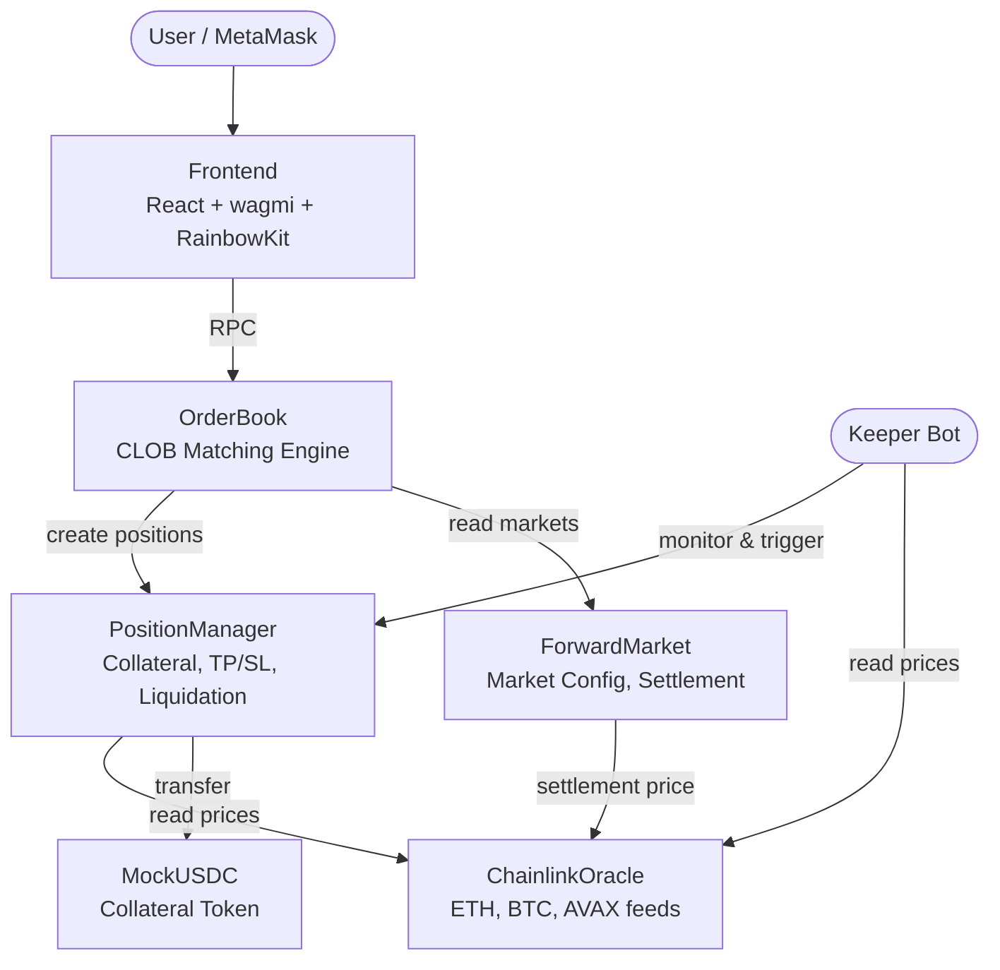

# Tenor Protocol -- Hackathon Jury Testing Guide

---

## 1. What is Tenor?

**Tenor** is the first on-chain Non-Deliverable Forward (NDF) exchange, built on Avalanche. It brings a $7 trillion/day traditional finance instrument to DeFi -- allowing anyone to trade cash-settled forward contracts on crypto assets (ETH, BTC, AVAX) with full collateral, no counterparty risk, and trustless settlement.

What makes it unique:

- **Fully on-chain CLOB** -- A Central Limit Order Book matching engine deployed entirely in smart contracts with price-time priority, partial fills, and market orders.
- **Chainlink oracle integration** -- Live ETH/USD, BTC/USD, and AVAX/USD price feeds for real-time PnL and trustless settlement at expiry.
- **Keeper-driven TP/SL and liquidation** -- An off-chain keeper bot continuously monitors positions and triggers take-profit, stop-loss, and liquidation on-chain.
- **Cash settlement** -- At forward expiry, positions are automatically settled in USDC based on the oracle price -- no physical delivery of the underlying asset.

---

## 2. Quick Links

| Resource | Link |
|---|---|
| **Frontend** | `http://localhost:5173` *(run locally -- see instructions below)* |
| **GitHub** | [github.com/skar8848/NDF-DEX](https://github.com/skar8848/NDF-DEX) |
| **Block Explorer** | [testnet.snowtrace.io](https://testnet.snowtrace.io) |
| **Network** | Avalanche Fuji Testnet (Chain ID `43113`) |
| **RPC** | `https://api.avax-test.network/ext/bc/C/rpc` |
| **Faucet (AVAX)** | [faucets.chain.link/fuji](https://faucets.chain.link/fuji) |

---

## 3. Setup (~2 minutes)

### Step 1: Add Avalanche Fuji to MetaMask

Open MetaMask and add a custom network with these values:

| Field | Value |
|---|---|
| Network Name | `Avalanche Fuji` |
| RPC URL | `https://api.avax-test.network/ext/bc/C/rpc` |
| Chain ID | `43113` |
| Currency Symbol | `AVAX` |
| Block Explorer | `https://testnet.snowtrace.io` |

> **Tip:** You can also add it automatically by visiting [chainlist.org](https://chainlist.org/?testnets=true&search=fuji) and clicking "Add to MetaMask".

### Step 2: Get test AVAX for gas

You need a small amount of AVAX to pay for transaction fees. Get free test AVAX from one of these faucets:

- **Chainlink Faucet** (recommended): [https://faucets.chain.link/fuji](https://faucets.chain.link/fuji)
- **Avalanche Core Faucet**: [https://core.app/tools/testnet-faucet/](https://core.app/tools/testnet-faucet/)

Paste your MetaMask wallet address, complete the captcha, and you should receive ~0.5 AVAX within seconds.

### Step 3: Import MockUSDC token in MetaMask

So you can see your USDC balance in MetaMask:

1. Open MetaMask on Fuji network
2. Click **Import tokens** at the bottom
3. Paste the token address: `0xA41BCF380ff358c849619538fda0Dd38214E019d`
4. Token Symbol and Decimals should auto-fill (`USDC`, `6`)
5. Click **Next** then **Import**

### Step 4: Run the frontend locally

```bash
git clone https://github.com/skar8848/NDF-DEX.git
cd NDF-DEX/frontend
npm install
npm run dev
```

Open [http://localhost:5173](http://localhost:5173) in your browser.

---

## 4. Testing via Frontend (Recommended)

### a) Connect your wallet

1. Click the **Connect** button in the top-right corner of the page.
2. Select **MetaMask** from the wallet list.
3. Approve the connection in MetaMask.
4. Make sure you are on the **Avalanche Fuji** network -- the app will prompt you to switch if you are not.

**What to expect:** Your wallet address appears in the header. The trading interface loads with live market data.

---

### b) Get test USDC

1. Click the **Faucet** button in the header bar.
2. Confirm the transaction in MetaMask (~0.01 AVAX gas fee).

**What to expect:** You receive **10,000 USDC** per faucet call. Your balance updates in the header and in the trade form's "Available" field. You can call the faucet multiple times if needed.

---

### c) Enable 1-Click Trading

After connecting, the trade form will show an **"Enable 1-Click Trading?"** prompt.

1. Click **Enable**.
2. Confirm the approval transaction in MetaMask.

**What this does:** It grants an unlimited USDC approval to the OrderBook contract, so you only sign **one** transaction per trade instead of two (approve + trade). This is optional -- you can click "Skip" and approve each trade individually.

---

### d) Select a market

In the trading view, use the market selector to choose one of:

| Market | Description |
|---|---|
| **ETH/USDC** | 30-day ETH forward contract |
| **BTC/USDC** | 30-day BTC forward contract |
| **AVAX/USDC** | 7-day AVAX forward contract |

**What to expect:** The order book, price chart, and oracle price update in real time for the selected market.

---

### e) Place a Limit Order

1. In the trade form, make sure **Limit** is selected as the order type.
2. Choose your side: **Long** (green) or **Short** (red).
3. Enter a **Price** (USD). To get an instant fill, set it slightly above the best ask (for longs) or slightly below the best bid (for shorts). The form will warn you if your price will fill immediately.
4. Enter a **Size** in contracts (e.g., `5`). Use the slider or preset buttons (25%, 50%, 75%, 100%) to size relative to your available balance.
5. *(Optional)* Set **TP / SL**:
   - **TP Price**: The price at which the keeper will automatically close your position for profit (e.g., entry + $50 for a long).
   - **SL Price**: The price at which the keeper will automatically close your position to limit loss (e.g., entry - $30 for a long).
6. Click the **Long ETH** (or **Short ETH**) button.
7. Confirm the transaction in MetaMask (or just sign if 1-Click Trading is enabled).

**What to expect:**
- The order appears in the **Order Book** on the left side.
- If a matching counter-order exists at a compatible price, the orders fill immediately and a position is created.
- The summary box shows the **margin required**, **estimated liquidation price**, **order value**, and **LTV**.

---

### f) Place a Market Order

1. Select **Market** as the order type.
2. Choose **Long** or **Short**.
3. Enter a **Size** in contracts.
4. *(Optional)* Adjust the **Slippage** tolerance (default 0.5%). Click the slippage value to see options: 0.1%, 0.5%, 1%, 2%, or a custom value.
5. Click the trade button.

**What to expect:** The order fills instantly against the existing order book. If there is not enough liquidity, you will see a depth warning (e.g., "Only 3 contracts available in the book -- order will be partially filled").

---

### g) Check your Position

After a fill, your position appears in the **Positions** table at the bottom of the trading view.

You can see:
- **Side** -- Long or Short
- **Entry Price** -- The price at which you entered
- **Size** -- Number of contracts
- **Collateral** -- USDC locked as margin
- **PnL** -- Unrealized profit/loss in real time (updates with oracle price)
- **ROE** -- Return on equity (PnL / collateral as a percentage)
- **TP/SL** -- Take-profit and stop-loss levels, if set

---

### h) Test Take-Profit / Stop-Loss

TP/SL is triggered by the **keeper bot** -- an off-chain process that monitors positions and calls the smart contract when conditions are met.

1. Set a tight TP on an open position (e.g., just $5 above entry for a long).
2. If the keeper is running and the oracle price reaches your TP, the position will be closed automatically.
3. Alternatively, you can manually close positions at any time (see next step).

> **Note:** If the keeper is not actively running, TP/SL will not trigger automatically. You can always close manually.

---

### i) Close a Position

1. In the **Positions** table, find the position you want to close.
2. Click the **Close** button on that row.
3. Use the slider to choose **partial** or **full** close.
4. Confirm the transaction.

**What to expect:** The position is closed at the current oracle price. Your PnL is settled: profit is added to your USDC balance, or loss is deducted from your collateral.

---

### j) Settlement (expired markets)

When a forward market reaches its expiration date:

1. Go to the **Portfolio** page.
2. Expired positions will show a **Settle** button.
3. Click **Batch Settle** to settle all expired positions at once.
4. The settlement price is the Chainlink oracle price at the time of settlement.

**What to expect:** Each position's PnL is calculated as `(settlePrice - entryPrice) * size` for longs (inverse for shorts), and USDC is distributed accordingly.

---

## 5. Testing via CLI (Technical Jury)

The CLI provides programmatic access to all protocol features. It is located in the `keeper/` directory.

### Setup

```bash
cd keeper
cp .env.example .env
```

Edit `.env` with your private key (the wallet you want to trade from):

```env
RPC_URL=https://avalanche-fuji-c-chain-rpc.publicnode.com
KEEPER_PRIVATE_KEY=0xYOUR_PRIVATE_KEY_HERE
POLL_INTERVAL_MS=5000
```

Install dependencies:

```bash
npm install
```

### Available Commands

```bash
# List all forward markets
npx tsx src/cli.ts markets

# View live oracle prices (Chainlink)
npx tsx src/cli.ts prices

# Mint 10,000 test USDC to your wallet
npx tsx src/cli.ts faucet

# Check your wallet balance (USDC + AVAX)
npx tsx src/cli.ts balance

# Place a MARKET order: go long 5 ETH contracts
npx tsx src/cli.ts trade long ETH 5 --market

# Place a LIMIT order: go short 3 ETH contracts at $2,500
npx tsx src/cli.ts trade short ETH 3 --price 2500

# View all open positions on the protocol
npx tsx src/cli.ts positions

# View only your open positions
npx tsx src/cli.ts positions --mine

# View details of a specific position
npx tsx src/cli.ts position 1

# Set take-profit and stop-loss on position #1
npx tsx src/cli.ts tpsl 1 --tp 3000 --sl 2000

# Close a position fully
npx tsx src/cli.ts close 1

# Close 50% of a position
npx tsx src/cli.ts close 1 --percent 50

# Start the keeper bot (monitors TP/SL, liquidations, settlement)
npx tsx src/cli.ts keeper
```

### Example End-to-End Flow

```bash
# 1. Get test tokens
npx tsx src/cli.ts faucet

# 2. Check balance
npx tsx src/cli.ts balance

# 3. See available markets
npx tsx src/cli.ts markets

# 4. Check current prices
npx tsx src/cli.ts prices

# 5. Open a long position on ETH
npx tsx src/cli.ts trade long ETH 5 --market

# 6. Verify the position
npx tsx src/cli.ts positions --mine

# 7. Set TP/SL
npx tsx src/cli.ts tpsl 1 --tp 3000 --sl 2000

# 8. Check position details
npx tsx src/cli.ts position 1

# 9. Close the position
npx tsx src/cli.ts close 1
```

---

## 6. Key Features to Evaluate

- [ ] **On-chain CLOB** -- Full limit order book with price-time priority matching, deployed in Solidity
- [ ] **Chainlink oracle integration** -- Live ETH/USD, BTC/USD, AVAX/USD price feeds on Fuji testnet
- [ ] **Limit orders** -- Place orders at a specific price; rest in the book until matched or cancelled
- [ ] **Market orders** -- Instant fill against existing book depth with configurable slippage tolerance
- [ ] **Long and short positions** -- Full directional trading on forward contracts
- [ ] **Collateral and margin system** -- Configurable LTV ratios, margin requirement display, liquidation price estimation
- [ ] **Liquidation mechanism** -- Under-collateralized positions can be liquidated with a 5% bonus to the liquidator
- [ ] **Take Profit / Stop Loss** -- On-chain TP/SL stored per position, triggered by the keeper bot when oracle price crosses the threshold
- [ ] **Partial and full position close** -- Close any percentage of a position at the current oracle price
- [ ] **Forward settlement at expiry** -- Chainlink-powered settlement at market expiration, PnL calculated and USDC distributed
- [ ] **Batch settlement** -- Settle multiple expired positions in a single transaction
- [ ] **1-Click Trading** -- One-time infinite USDC approval to skip per-trade approval popups
- [ ] **CLI for programmatic access** -- Full-featured command-line interface for all trading operations
- [ ] **Keeper bot** -- Automated off-chain bot for TP/SL execution, liquidation, and settlement
- [ ] **Real-time PnL and ROE** -- Live unrealized profit/loss and return-on-equity display, updating with oracle prices
- [ ] **20 unit and integration tests** -- ForwardMarket (8), OrderBook (7), Settlement (5) test suites via Foundry

---

## 7. Contract Addresses (Avalanche Fuji)

All contracts are deployed and live on Avalanche Fuji Testnet:

| Contract | Address | Explorer |
|---|---|---|
| **MockUSDC** | `0xA41BCF380ff358c849619538fda0Dd38214E019d` | [View on SnowTrace](https://testnet.snowtrace.io/address/0xA41BCF380ff358c849619538fda0Dd38214E019d) |
| **MockWETH** | `0xC2DFD7581C9D27ac195C3873f12b93e7eCd4B24c` | [View on SnowTrace](https://testnet.snowtrace.io/address/0xC2DFD7581C9D27ac195C3873f12b93e7eCd4B24c) |
| **ChainlinkOracle** | `0x23196688CDc03348d712BBc2E74CeA4Eea1e60EB` | [View on SnowTrace](https://testnet.snowtrace.io/address/0x23196688CDc03348d712BBc2E74CeA4Eea1e60EB) |
| **ForwardMarket** | `0x281dc4C64D2BF3508bA2670897f321a31F5e1e65` | [View on SnowTrace](https://testnet.snowtrace.io/address/0x281dc4C64D2BF3508bA2670897f321a31F5e1e65) |
| **OrderBook** | `0x74AeE1AdBcE40B984beA4B09deAf581c6139cbC9` | [View on SnowTrace](https://testnet.snowtrace.io/address/0x74AeE1AdBcE40B984beA4B09deAf581c6139cbC9) |
| **PositionManager** | `0xAB6b565384773C70da8D9e254aFB4B59d710eaD7` | [View on SnowTrace](https://testnet.snowtrace.io/address/0xAB6b565384773C70da8D9e254aFB4B59d710eaD7) |

### Chainlink Price Feeds (Fuji)

| Feed | Address |
|---|---|
| ETH/USD | `0x86d67c3D38D2bCeE722E601025C25a575021c6EA` |
| BTC/USD | `0x31CF013A08c6Ac228C94551d535d5BAfE19c602a` |
| AVAX/USD | `0x5498BB86BC934c8D34FDA08E81D444153d0D06aD` |

---

## 8. Architecture Overview

```
                         +------------------+
                         |    Frontend      |
                         |  (React + wagmi) |
                         +--------+---------+
                                  |
                                  | RPC (Avalanche Fuji)
                                  v
              +-------------------------------------------+
              |           Smart Contracts (Solidity)       |
              |                                           |
              |  +-------------+    +-----------------+   |
              |  | ForwardMarket|<-->|   OrderBook     |   |
              |  | (markets,   |    | (CLOB matching, |   |
              |  |  settlement)|    |  limit/market)  |   |
              |  +-------------+    +--------+--------+   |
              |                              |            |
              |                     +--------v--------+   |
              |                     | PositionManager |   |
              |                     | (positions,     |   |
              |                     |  collateral,    |   |
              |                     |  TP/SL, liq.)   |   |
              |                     +--------+--------+   |
              |                              |            |
              |  +---------------+  +--------v--------+   |
              |  |   MockUSDC   |  | ChainlinkOracle |   |
              |  | (collateral) |  | (ETH, BTC, AVAX)|   |
              |  +---------------+  +-----------------+   |
              +-------------------------------------------+
                                  ^
                                  | Monitors + triggers
                         +--------+---------+
                         |    Keeper Bot    |
                         | (TP/SL, liq.,   |
                         |  settlement)    |
                         +-----------------+
```



### Data Flow

1. **User** connects wallet via RainbowKit and interacts through the React frontend.
2. **OrderBook** receives limit/market orders and matches them using price-time priority. On a match, it calls PositionManager to create positions for both parties.
3. **PositionManager** holds all position state, manages collateral (USDC deposits), and handles close/liquidation/settlement logic. TP/SL targets are stored on-chain per position.
4. **ChainlinkOracle** provides live price feeds from Chainlink's Fuji testnet aggregators, used for PnL calculation, liquidation checks, and forward settlement.
5. **Keeper Bot** runs off-chain, polling every 5 seconds. It fetches all open positions, checks TP/SL triggers, health factors for liquidation, and expired markets for settlement -- then submits transactions to execute.

---

## 9. Troubleshooting

| Problem | Solution |
|---|---|
| **"Transaction failed"** | Check your AVAX balance -- you need AVAX for gas fees. Get more from the [Chainlink Faucet](https://faucets.chain.link/fuji). |
| **"Insufficient USDC"** or balance shows 0 | Click the **Faucet** button in the header to mint 10,000 test USDC. You can call it multiple times. |
| **Order placed but no fill** | Your limit order is resting in the book. It will fill when a matching counter-order arrives. Place a market order for instant execution, or set a limit price that crosses the spread. |
| **TP/SL not triggering** | The keeper bot must be running for TP/SL to execute. If testing locally, run `npx tsx src/cli.ts keeper` in the `keeper/` directory. |
| **"Wrong network" warning** | Switch MetaMask to Avalanche Fuji (Chain ID 43113). The app will prompt you automatically. |
| **Token not showing in MetaMask** | Import the MockUSDC token manually: `0xA41BCF380ff358c849619538fda0Dd38214E019d` |
| **Slow transactions** | Fuji testnet can occasionally be slow. Wait 10-15 seconds. Check [testnet.snowtrace.io](https://testnet.snowtrace.io) for your transaction status. |
| **"Not orderbook" error** | This is an internal contract permission error. Make sure you are interacting through the frontend or CLI, not calling PositionManager directly. |

---

## 10. Running the Tests

The smart contracts include 20 unit and integration tests:

```bash
cd contracts
forge install    # Install Foundry dependencies (first time only)
forge test -vvv  # Run all tests with verbose output
```

| Test Suite | Tests | What It Covers |
|---|---|---|
| `ForwardMarket.t.sol` | 8 | Market creation, settlement, reverts, active market filtering |
| `OrderBook.t.sol` | 7 | Limit orders, matching, partial fills, cancellation, price crossing |
| `Settlement.t.sol` | 5 | Long/short profit, liquidation, collateral management, settlement guards |

---

*Built with Solidity, Foundry, React, wagmi, Chainlink, and Avalanche.*
