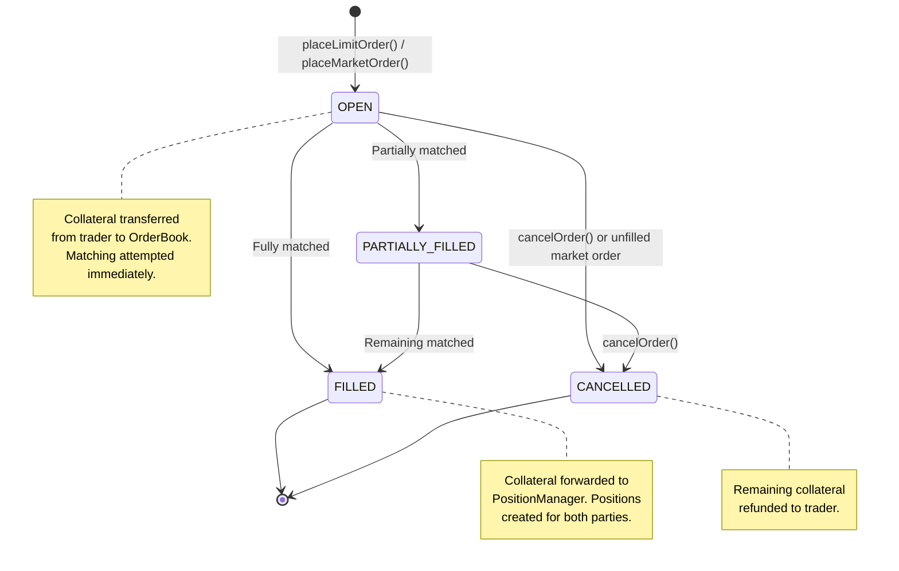
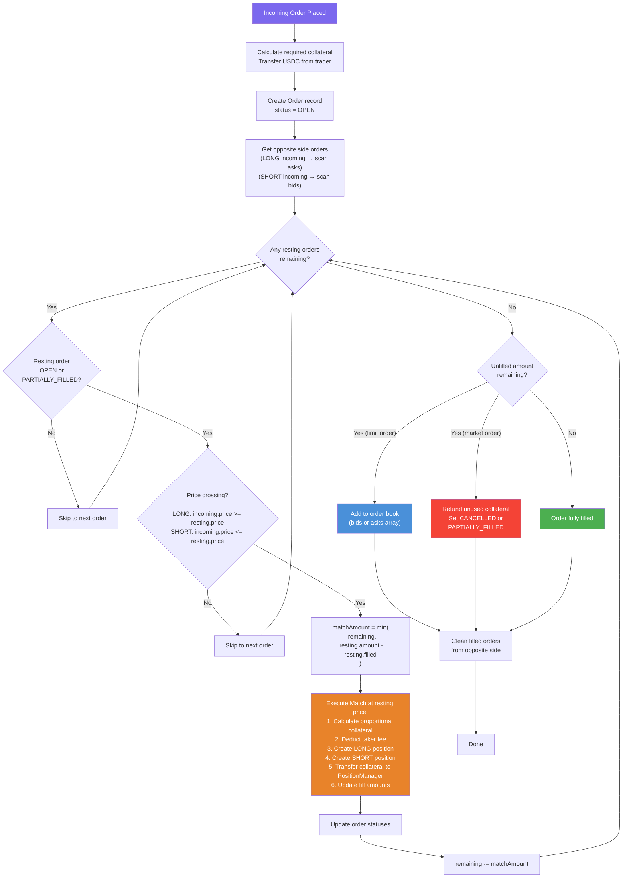
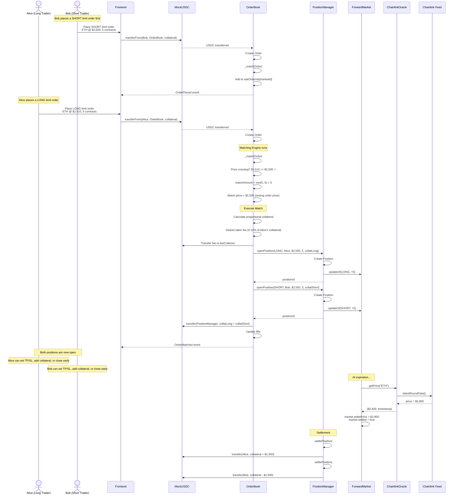

# Order Matching Engine

The Tenor OrderBook implements a fully on-chain Central Limit Order Book (CLOB) with automatic matching. When an order is placed, the matching engine immediately attempts to fill it against resting orders on the opposite side. Unfilled quantities rest in the book until matched or cancelled.

---

## Order Book Structure

The order book maintains two arrays per market:

- **Bids** (`bidOrderIds[marketId]`) -- LONG orders, representing buy interest
- **Asks** (`askOrderIds[marketId]`) -- SHORT orders, representing sell interest

Each order stores:
- **price** -- Limit price in 8 decimals (e.g., `250000000000` = $2,500.00)
- **amount** -- Number of contracts (integer)
- **filled** -- How many contracts have been filled so far
- **collateral** -- USDC locked (6 decimals)
- **status** -- OPEN, FILLED, PARTIALLY_FILLED, or CANCELLED

---

## Order Types

### Limit Orders

A limit order specifies an exact price. The trader deposits collateral calculated as:

```
collateral = amount * price / PRICE_PRECISION * COLLATERAL_PRECISION * PERCENT_BASE / ltv
```

For a market with 50% LTV (ltv = 5000), buying 5 contracts of ETH at $2,500:
```
collateral = 5 * 250000000000 / 1e8 * 1e6 * 10000 / 5000
           = 5 * 2500 * 1e6 * 2
           = $25,000 USDC (25,000,000,000 in 6 decimals)
```

The collateral must meet the market's `minCollateral` requirement.

### Market Orders

Market orders use extreme price bounds to ensure execution:
- **LONG market order:** price = `type(uint256).max / 2` (willing to buy at any price)
- **SHORT market order:** price = `1` (willing to sell at any price)

Collateral is calculated at `2x the oracle price` to ensure sufficient coverage. After matching, any unused collateral from unfilled contracts is refunded to the trader. If no fills occur, the order is cancelled and the full deposit is returned.

---

## Order Lifecycle



---

## Matching Algorithm



---

## Full Trade Flow



---

## Collateral Calculation

Collateral is the USDC deposit required to open a position. It is determined by the order price, position size, and the market's Loan-to-Value (LTV) ratio.

### Formula

```
collateral = (amount * price / PRICE_PRECISION) * COLLATERAL_PRECISION * PERCENT_BASE / ltv
```

Where:
- `PRICE_PRECISION = 1e8` (8 decimal places for prices)
- `COLLATERAL_PRECISION = 1e6` (6 decimal places for USDC)
- `PERCENT_BASE = 1e4` (10000 = 100%)
- `ltv` is in basis points (e.g., 5000 = 50%)

### Example

| Parameter | Value |
|---|---|
| Asset | ETH |
| Order price | $2,500.00 |
| Size | 10 contracts |
| Market LTV | 50% (5000 bps) |

```
collateral = (10 * 250000000000 / 1e8) * 1e6 * 10000 / 5000
           = 25000 * 1e6 * 2
           = 50,000,000,000  (= $50,000 USDC)
```

The higher the LTV, the less collateral is required (more leverage). At 50% LTV, the trader effectively has 2x leverage.

### Minimum Collateral

Each market defines a `minCollateral` floor. Orders whose calculated collateral falls below this minimum are rejected.

---

## Liquidation

Positions can be liquidated when their health factor drops below 100% (10000 in basis points).

### Health Factor Formula

```
equity = collateral + PnL
maintenanceMargin = size * entryPrice * liquidationThreshold * COLLATERAL_PRECISION / (PRICE_PRECISION * PERCENT_BASE)
healthFactor = equity * PERCENT_BASE / maintenanceMargin
```

- `healthFactor >= 10000` -- Position is healthy
- `healthFactor < 10000` -- Position is liquidatable

### Liquidation Incentive

The liquidator receives a 5% bonus (`LIQUIDATION_BONUS = 500 bps`) from the position's remaining collateral. The rest is returned to the position's trader.

```
liquidatorBonus = min(remaining_collateral * 5%, remaining_collateral)
traderRefund = remaining_collateral - liquidatorBonus
```

---

## Partial Fills

Both limit and market orders support partial fills. When an incoming order is larger than a resting order, the engine:

1. Fills the resting order completely
2. Continues scanning the next resting order
3. Repeats until the incoming order is fully filled or no more matching resting orders exist

Collateral is allocated proportionally to the filled amount:

```
collatForFill = order.collateral * matchAmount / (order.amount - order.filled)
```

After a partial fill:
- The resting order updates to `PARTIALLY_FILLED` and remains in the book
- The incoming order may also become `PARTIALLY_FILLED` and rest in the book (for limit orders) or refund the remainder (for market orders)

---

## Fee Structure

| Fee | Rate | Description |
|---|---|---|
| Taker fee | 10 bps (0.10%) | Charged on the taker (incoming) order's collateral at match time |
| Maker fee | 0 bps | No fee for resting (maker) orders |

The taker fee is calculated on the collateral portion corresponding to the matched amount and is immediately transferred to the `feeCollector` address. The fee is deducted from the taker's collateral before it is forwarded to the PositionManager, meaning the taker's resulting position has slightly less collateral than a maker's equivalent position.

The fee rate is configurable by the contract owner (max 10% / 1000 bps). The `feeCollector` address is also configurable.
