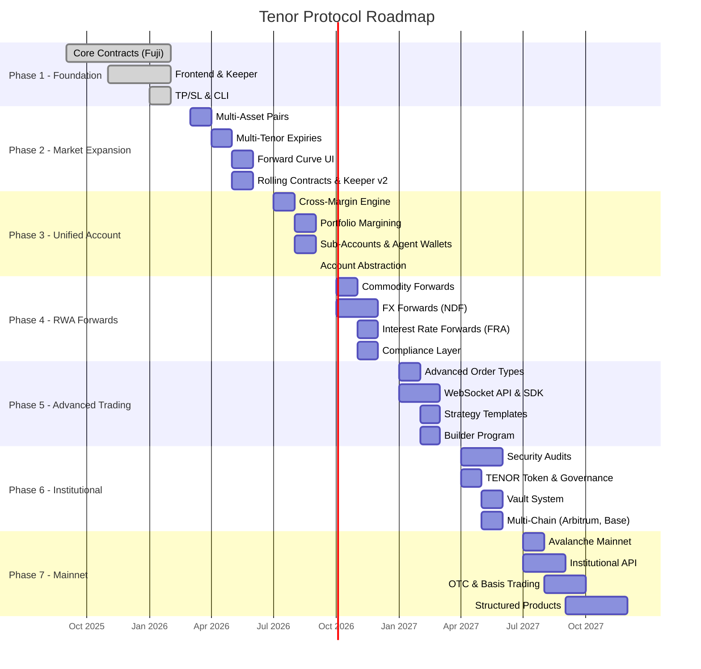

# Tenor Protocol: The Decentralized Forward Exchange

> *Bringing the $846 trillion OTC derivatives market on-chain -- starting with Non-Deliverable Forwards.*

---

## Vision

Forward contracts are the backbone of global finance. Every day, over **$7 trillion** in FX forwards alone change hands between banks, hedge funds, and corporates. The total OTC derivatives market reached **$846 trillion** in notional outstanding at mid-2025 (BIS data). Yet this massive market remains trapped behind institutional walls: bilateral credit agreements, minimum $1M notionals, T+2 settlement, and zero transparency.

**Tenor Protocol** is building the infrastructure to bring this market on-chain. Starting with crypto Non-Deliverable Forwards (NDFs) on Avalanche, we are systematically expanding to cover the full spectrum of forward instruments -- from commodity and FX forwards to interest rate forward agreements -- all permissionless, fully collateralized, and settled trustlessly via oracle.

Tenor is not another perp DEX. Perpetual futures have no expiry, no forward curve, and no term structure. Tenor offers **dated forwards** -- contracts with fixed expiration, enabling a true on-chain forward curve for the first time. This unlocks use cases that perps simply cannot serve: hedging future receivables, locking in future prices, basis trading, and building a yield curve from market prices.

### Why Forwards Matter

```
Perpetual Futures:              Dated Forwards (Tenor):
- No expiry                     - Fixed expiry (1W, 1M, 3M, 6M, 1Y)
- Funding rate mechanics        - Forward premium/discount
- No term structure             - Full forward curve
- Speculation-focused           - Hedging + speculation + basis trading
- $150B daily volume            - $7T+ daily volume (TradFi)
```

The opportunity is not to compete with Hyperliquid or dYdX on perpetual futures. It is to own an entirely separate, far larger market that no one else in DeFi is building for.

---

## Phase 1: Foundation (Current -- v4)

*Status: Live on Avalanche Fuji Testnet*

### What is Built

Tenor v4 is a fully functional on-chain NDF exchange with the following components:

| Component | Description | Status |
|-----------|-------------|--------|
| **ForwardMarket.sol** | Market creation, configurable LTV, liquidation threshold, expiration management | Deployed |
| **OrderBook.sol** | Full on-chain CLOB with price-time priority, partial fills, market orders | Deployed |
| **PositionManager.sol** | Position tracking, collateral management, liquidation engine (5% bonus), cash settlement | Deployed |
| **ChainlinkOracle.sol** | Live Chainlink feeds (ETH/USD, BTC/USD, AVAX/USD) normalized to 8 decimals | Deployed |
| **Keeper Bot** | TypeScript keeper for TP/SL execution, settlement monitoring, CLI interface | Operational |
| **React Frontend** | Full trading UI with order book visualization, portfolio tracking, TradingView charts | Deployed |
| **SDK** | TypeScript SDK for programmatic interaction | In progress |

### Deployed Contracts (Avalanche Fuji)

| Contract | Address |
|----------|---------|
| MockUSDC | `0x47f5a33714a84178F83f65Be6ecBcB79ACe6ef44` |
| ForwardMarket | `0x9BB9CD8a6Caeaa06cBdB35FAc37D88C3b7b3DfC2` |
| OrderBook | `0xc6727c3cF00e374d72B1348173E4308083BC97e2` |
| PositionManager | `0xBDb0b90825b4d5f8dA0A9D54fb2E72EA02618C56` |

### Initial Markets

- ETH/USDC Forward (30-day expiry)
- BTC/USDC Forward (30-day expiry)
- AVAX/USDC Forward (7-day expiry)

### Key Achievements

- 20 unit and integration tests covering market creation, order matching, settlement, and liquidation
- Automatic TP/SL execution via keeper bot (verified end-to-end on Fuji)
- CLI interface for programmatic trading
- Live Chainlink oracle integration with fallback to manual prices

---

## Phase 2: Market Expansion & Forward Curve (Q2 2026)

*Goal: Transform from a single-expiry prototype into a multi-tenor forward exchange with a visible term structure.*

### 2.1 Multi-Asset Expansion

Add forward markets for the top DeFi assets, each backed by Chainlink oracle feeds:

| Asset | Chainlink Feed | Priority |
|-------|---------------|----------|
| SOL/USD | Available on multiple chains | High |
| LINK/USD | Native Chainlink support | High |
| MATIC/USD | Available on Avalanche | High |
| ARB/USD | Available cross-chain | Medium |
| OP/USD | Available cross-chain | Medium |
| DOGE/USD | Available on Avalanche | Medium |
| AAVE/USD | Available on Avalanche | Low |
| UNI/USD | Available on Avalanche | Low |

### 2.2 Multiple Expiry Dates Per Asset

This is the core differentiator. Each asset gets a **term structure** of forward contracts:

```
ETH/USDC Forward Curve (example):

  Forward     |
  Premium     |          *
  (annualized)|       *
              |    *
              | *
              +--+------+------+------+------→ Expiry
               1W      1M     3M     6M    1Y

  1W:  ETH spot $2,500 → 1W Forward $2,504  (0.8% annualized premium)
  1M:  ETH spot $2,500 → 1M Forward $2,520  (1.0% annualized premium)
  3M:  ETH spot $2,500 → 3M Forward $2,575  (1.2% annualized premium)
  6M:  ETH spot $2,500 → 6M Forward $2,680  (1.4% annualized premium)
```

**Inspiration: Pendle Finance** -- Pendle proved that DeFi users will trade instruments with expiration dates. Their PT (Principal Token) prices across multiple maturities create an implied yield curve. Tenor does the same for forward prices. Just as Pendle's time-aware AMM makes PT prices converge toward par as maturity approaches, Tenor's forward prices converge toward the oracle spot price at expiry.

### 2.3 Forward Curve Visualization

Build a dedicated forward curve page in the frontend:

- **Interactive curve chart** showing all active expiry dates for each asset
- **Implied basis** (forward premium/discount) in annualized percentage
- **Historical curve snapshots** -- how the forward curve has shifted over time
- **Contango/backwardation indicators** -- visual signals when the curve shape changes
- **Cross-asset comparison** -- overlay forward curves for ETH, BTC, SOL on the same chart

### 2.4 Rolling Contracts

Inspired by TradFi rolling futures:

- Automatic market creation for standard tenors (1W, 1M, 3M) on a rolling basis
- When the 1W contract expires on Friday, a new 1W contract is automatically listed
- Keeper infrastructure to manage the lifecycle of rolling contracts

### 2.5 Improved Keeper Infrastructure

- **Multi-market settlement** -- single keeper monitors all active markets
- **Gas optimization** -- batch settlement transactions
- **Redundant keeper network** -- multiple keepers with leader election
- **Alert system** -- Discord/Telegram notifications for settlements and liquidations
- **Keeper incentives** -- gas rebates + protocol fee share for keepers

### 2.6 Deliverables

- [ ] Smart contract upgrades for multi-tenor market factory
- [ ] Forward curve data aggregation and API
- [ ] Frontend forward curve visualization page
- [ ] Rolling contract automation
- [ ] Keeper v2 with multi-market support
- [ ] 8+ new asset pairs live

---

## Phase 3: Unified Trading Account (Q3 2026)

*Goal: Institutional-grade account management inspired by Hyperliquid's unified account system.*

### 3.1 Cross-Margin Account

**Inspiration: Hyperliquid** -- Hyperliquid's unified account provides a single balance that collateralizes all cross-margin positions. This is the gold standard for capital efficiency in derivatives trading. Tenor must match this.

Current state: Each position has isolated collateral. A trader with 5 positions needs 5 separate collateral deposits.

Target state: A single USDC balance collateralizes all positions. Unrealized PnL from winning positions offsets margin requirements for losing positions.

```
Current (Isolated Margin):
  Position 1: ETH LONG   → $5,000 collateral locked
  Position 2: BTC SHORT  → $3,000 collateral locked
  Position 3: SOL LONG   → $2,000 collateral locked
  Total locked: $10,000

Target (Cross-Margin):
  Account balance: $10,000
  Position 1: ETH LONG   → $5,000 notional (requires $1,250 margin)
  Position 2: BTC SHORT  → $3,000 notional (requires $750 margin)
  Position 3: SOL LONG   → $2,000 notional (requires $500 margin)
  Total margin used: $2,500
  Free margin: $7,500  ← can open more positions
```

### 3.2 Portfolio Margining

**Inspiration: Hyperliquid's portfolio margin (pre-alpha)** -- a single portfolio unifying all eligible assets.

Go beyond cross-margin to recognize hedged positions:

- **Delta netting**: If you are LONG ETH 1M forward and SHORT ETH 3M forward, the net delta is near zero. Margin requirement should reflect the spread risk, not the full notional.
- **Calendar spread margining**: Recognized offset for positions in different expiries of the same asset.
- **Cross-asset correlation**: Reduced margin for hedged portfolios (e.g., LONG ETH + SHORT BTC has lower risk than either leg alone).

### 3.3 Sub-Accounts

Enable institutional-grade account segregation:

- **Strategy isolation** -- run different strategies in separate sub-accounts
- **Risk ring-fencing** -- a blowup in one sub-account does not affect others
- **PnL attribution** -- track performance per strategy
- **Agent wallets** -- delegate trading authority to bot wallets without exposing the master key

### 3.4 PnL Netting & Settlement

- Real-time unrealized PnL calculation across all positions
- Net settlement: when multiple positions expire, calculate the net USDC flow
- Settlement netting reduces gas costs and capital lockup

### 3.5 Account Abstraction

**Inspiration: Hyperliquid's account abstraction modes** -- Allow trading via:

- **Main wallet** -- standard MetaMask/WalletConnect
- **Agent wallet** -- delegated signing for bots/APIs (similar to Hyperliquid's `ApproveAgent`)
- **Session keys** -- temporary trading authority with spending limits
- **Smart account** -- ERC-4337 compatible for institutional multi-sig workflows

### 3.6 Deliverables

- [ ] CrossMarginAccount.sol -- unified collateral pool per user
- [ ] PortfolioMargin.sol -- risk engine with delta netting and correlation-based offsets
- [ ] SubAccountManager.sol -- sub-account creation and isolation
- [ ] AgentWallet.sol -- delegated trading authority
- [ ] Frontend portfolio dashboard with real-time cross-margin metrics
- [ ] Migration tool from isolated to cross-margin positions

---

## Phase 4: RWA Forwards (Q4 2026)

*Goal: Expand beyond crypto to real-world asset forwards -- the $846 trillion opportunity.*

### 4.1 Commodity Forwards

**Inspiration: TradFi commodity forwards + Chainlink price feeds**

Bring commodity forward trading on-chain for the first time:

| Commodity | Oracle Source | Use Case |
|-----------|-------------|----------|
| XAU/USD (Gold) | Chainlink | Miners hedging future production |
| XAG/USD (Silver) | Chainlink | Industrial hedging |
| WTI Crude Oil | Chainlink + Chronicle | Energy companies hedging |
| Natural Gas | Chronicle / Pyth | Utility cost hedging |

```
Example: Gold Forward

A miner expects to produce 100 oz of gold in 3 months.
Current spot: $2,300/oz

Miner SHORTS a 3M Gold Forward at $2,320/oz (forward premium)
  → Locks in sale price regardless of gold price movement
  → $232,000 guaranteed revenue

If gold drops to $2,100 at expiry:
  → Forward PnL: +$220/oz = +$22,000 (cash settled)
  → Physical sale at spot: $210,000
  → Total revenue: $232,000 ← hedged perfectly
```

### 4.2 FX Forwards

**Inspiration: Non-Deliverable Forwards in TradFi** -- This is literally what Tenor was built for.

The NDF market trades $7 trillion per day. Bring the most liquid pairs on-chain:

| Pair | Daily Volume (TradFi) | Oracle Source |
|------|----------------------|---------------|
| EUR/USD | $800B+ | Chainlink |
| GBP/USD | $400B+ | Chainlink |
| USD/JPY | $600B+ | Chainlink |
| USD/CNH | $200B+ | NDF market (offshore RMB) |
| BRL/USD | $50B+ | Chainlink |

**NDF pricing** follows the covered interest rate parity:

```
Forward Rate = Spot Rate x (1 + r_domestic) / (1 + r_foreign)

EUR/USD Example:
  Spot: 1.0800
  US rate: 5.25%
  EUR rate: 4.00%
  90-day forward: 1.0800 x (1 + 0.0525 x 90/360) / (1 + 0.0400 x 90/360)
                = 1.0800 x 1.013125 / 1.010000
                = 1.0834

  The forward trades at a premium because US rates > EUR rates.
```

### 4.3 Interest Rate Forwards (FRAs)

**Inspiration: Pendle Finance yield markets + TradFi Forward Rate Agreements**

Forward Rate Agreements (FRAs) are the building block of the interest rate derivatives market. Bring them on-chain:

- **DeFi Rate Forwards**: Lock in future DeFi lending rates (Aave, Compound, Morpho)
- **Basis Rate Forwards**: Trade the spread between DeFi rates and TradFi rates
- **Yield Curve Construction**: Multiple FRA tenors create an on-chain DeFi yield curve

```
Example: Aave USDC Lending Rate FRA

Current Aave USDC rate: 4.5%
Trader believes rates will rise.

BUY a 3x6 FRA (3-month rate, starting in 3 months) at 5.0%

If 3-month Aave USDC rate in 3 months = 6.0%:
  Settlement = (6.0% - 5.0%) x Notional x (90/360)
             = +0.25% x $100,000
             = +$250 (cash settled)
```

### 4.4 RWA Oracle Infrastructure

**Inspiration: Ondo Finance and Centrifuge** -- partner with institutional-grade oracle providers:

- **Chainlink** -- primary oracle for major assets (already integrated)
- **Chronicle Protocol** -- MakerDAO's oracle network, commodity-grade feeds
- **Pyth Network** -- high-frequency price feeds, strong on commodities and FX
- **RedStone** -- modular oracle with RWA feeds
- **API3** -- first-party oracle data from TradFi data providers
- **Custom TWAP oracles** -- for DeFi rate feeds (Aave, Compound pool rates)

### 4.5 Compliance Layer

RWA forwards require a compliance wrapper:

- **KYC/KYB integration** -- optional KYC gate for regulated asset forwards
- **Accredited investor verification** -- for certain commodity/FX forwards
- **Geofencing** -- restrict access to certain markets by jurisdiction
- **Reporting API** -- exportable trade history for tax and regulatory reporting

**Inspiration: Centrifuge V3** -- Centrifuge's institutional-grade compliance layer with 21 independent audits shows the path. Their ERC-4626 vaults with compliance hooks are a model for regulated DeFi.

### 4.6 Deliverables

- [ ] RWAForwardMarket.sol -- extended market contract for RWA assets
- [ ] OracleAggregator.sol -- multi-source oracle with fallback logic
- [ ] FRASettlement.sol -- interest rate forward settlement logic
- [ ] ComplianceGate.sol -- optional KYC/accredited investor gate
- [ ] Oracle integration with Pyth, Chronicle, RedStone
- [ ] 5+ commodity pairs, 3+ FX pairs, 2+ interest rate forwards live

---

## Phase 5: Advanced Trading (Q1 2027)

*Goal: Match the trading experience of Hyperliquid and dYdX with forward-specific innovations.*

### 5.1 Advanced Order Types

**Inspiration: dYdX v4 and Hyperliquid order types**

| Order Type | Description | Use Case |
|------------|-------------|----------|
| **Stop-Limit** | Trigger a limit order when price hits a threshold | Risk management |
| **Trailing Stop** | Stop price moves with the market by a fixed offset | Lock in profits |
| **OCO (One-Cancels-Other)** | Pair of orders where filling one cancels the other | Bracket orders |
| **Iceberg** | Large order split into smaller visible portions | Reduce market impact |
| **TWAP** | Time-Weighted Average Price execution over a period | Large order execution |
| **Fill-or-Kill** | Execute entirely or cancel -- no partial fills | Atomic execution |
| **Good-Till-Date** | Order expires at a specific time | Forward-specific timing |
| **Spread Order** | Simultaneously buy one expiry and sell another | Calendar spread trading |

### 5.2 Calendar Spread Trading

A first-of-its-kind DeFi feature -- trade the spread between two expiry dates:

```
Calendar Spread Example:

BUY ETH 1M Forward at $2,520
SELL ETH 3M Forward at $2,575
Net: Paying $55 for the 1M-3M spread

If the forward curve flattens:
  1M Forward → $2,530 (+$10)
  3M Forward → $2,555 (-$20)
  Spread PnL: +$30

This is pure term-structure trading -- no directional exposure to ETH.
```

### 5.3 Streaming API & WebSocket

**Inspiration: Hyperliquid's sub-200ms latency API**

Build a real-time data infrastructure for algorithmic trading:

```
WebSocket Channels:
  ws://api.tenor.exchange/v1/ws

  → orderbook:{market_id}      # Real-time L2 order book updates
  → trades:{market_id}         # Live trade stream
  → positions:{account}        # Position updates
  → forwards:{asset}           # Forward curve tick data
  → liquidations               # Protocol-wide liquidation feed
  → settlements                # Settlement event stream

REST API:
  GET  /v1/markets              # All active markets
  GET  /v1/markets/{id}/book    # Order book snapshot
  GET  /v1/curve/{asset}        # Forward curve data
  POST /v1/orders               # Place order
  DELETE /v1/orders/{id}        # Cancel order
  GET  /v1/account/{address}    # Account summary
  GET  /v1/positions/{address}  # All positions
```

### 5.4 SDK & Strategy Templates

**Inspiration: dYdX TypeScript/Python SDKs**

Provide production-ready SDKs:

```typescript
// Tenor SDK Example
import { TenorClient, ForwardCurve } from '@tenor-protocol/sdk';

const client = new TenorClient({
  rpcUrl: 'https://api.avax.network/ext/bc/C/rpc',
  privateKey: process.env.PRIVATE_KEY,
});

// Get the ETH forward curve
const curve: ForwardCurve = await client.getForwardCurve('ETH');
console.log(curve.tenors);
// → [{ expiry: '1W', price: 2504, basis: 0.8 },
//    { expiry: '1M', price: 2520, basis: 1.0 },
//    { expiry: '3M', price: 2575, basis: 1.2 }]

// Execute a calendar spread
await client.executeSpread({
  asset: 'ETH',
  buyExpiry: '1M',
  sellExpiry: '3M',
  size: 10,
  maxSpreadPrice: 60, // max $60 per contract
});
```

### 5.5 Automated Strategies

Pre-built strategy templates:

| Strategy | Description |
|----------|-------------|
| **Basis Trading** | Long spot + short forward to capture the forward premium |
| **Calendar Spread** | Long near-dated + short far-dated forward |
| **DCA into Forwards** | Dollar-cost average into forward positions over time |
| **Roll Strategy** | Automatically roll expiring positions to the next tenor |
| **Curve Steepener/Flattener** | Trade forward curve shape changes |

### 5.6 Builder / Referral Program

**Inspiration: Hyperliquid Builder Codes** -- Hyperliquid's builder codes surpassed $10M in revenue by enabling third-party apps to earn fees on orders they route.

- **Builder codes**: Third-party apps and bots earn a fee on every order they route through Tenor
- **Fee sharing**: Configurable fee split between protocol, builder, and user
- **Referral program**: 10% commission on referred trading fees
- **On-chain attribution**: All builder revenue tracked and distributed on-chain

### 5.7 Deliverables

- [ ] AdvancedOrders.sol -- stop-limit, trailing stop, OCO, iceberg
- [ ] SpreadOrder.sol -- atomic calendar spread execution
- [ ] WebSocket gateway server with sub-second latency
- [ ] REST API with rate limiting and API key management
- [ ] TypeScript SDK (`@tenor-protocol/sdk`)
- [ ] Python SDK (`tenor-sdk`)
- [ ] 5 pre-built strategy templates
- [ ] Builder code smart contract and dashboard

---

## Phase 6: Institutional Grade (Q2 2027)

*Goal: Earn the trust of institutional capital through security, governance, and multi-chain reach.*

### 6.1 Security & Audits

**Inspiration: Centrifuge (21 independent audits), Hyperliquid (custom consensus with formal verification)**

| Audit | Scope | Timeline |
|-------|-------|----------|
| **Trail of Bits** | Core contracts (ForwardMarket, OrderBook, PositionManager) | Q2 2027 |
| **OpenZeppelin** | Cross-margin engine, portfolio margin, settlement logic | Q2 2027 |
| **Spearbit** | Oracle integration, RWA compliance layer | Q2 2027 |
| **Code4rena contest** | Community audit with bounties | Q2 2027 |

Additional security measures:

- **Formal verification** of settlement math (PnL calculations, margin requirements)
- **Invariant testing** with Foundry (invariant fuzz tests for all state transitions)
- **Bug bounty program** -- up to $500K for critical vulnerabilities
- **Real-time monitoring** -- Forta/OpenZeppelin Defender alerts for anomalous transactions

### 6.2 Insurance Fund

**Inspiration: dYdX Insurance Fund + GMX GLP model**

The insurance fund backstops the protocol against:

- **Socialized losses** from liquidation shortfalls
- **Oracle failures** that cause incorrect settlement
- **Smart contract bugs** (pre-audit coverage)

```
Insurance Fund Architecture:

Revenue Sources:
  → 10% of all trading fees
  → 50% of liquidation bonuses
  → 100% of settlement fee surplus
  → Initial protocol treasury allocation

Trigger Conditions:
  → Liquidation cascade with insufficient collateral
  → Oracle deviation > 5% from multiple sources
  → Emergency admin trigger (timelocked)

Payout Mechanism:
  → Automatic: covers shortfall in settlement
  → Governance: large payouts require DAO vote
```

### 6.3 Governance Token: TENOR

| Parameter | Value |
|-----------|-------|
| **Name** | Tenor |
| **Symbol** | TENOR |
| **Total Supply** | 1,000,000,000 |
| **Chain** | Avalanche C-Chain |

**Distribution:**

```
Community & Ecosystem     40%    (400M TENOR)
  → Trading rewards        20%
  → Liquidity incentives   10%
  → Grants & bounties       5%
  → Airdrop                 5%

Team & Advisors           20%    (200M TENOR)
  → 1-year cliff, 3-year linear vest

Investors                 15%    (150M TENOR)
  → 6-month cliff, 2-year linear vest

Treasury                  15%    (150M TENOR)
  → DAO-controlled

Insurance Fund            10%    (100M TENOR)
  → Protocol backstop
```

### 6.4 DAO-Managed Parameters

TENOR holders govern:

- **Fee tiers** -- trading fees, settlement fees, liquidation bonuses
- **Margin parameters** -- LTV ratios, liquidation thresholds, maintenance margin
- **Market listings** -- approve new asset pairs and expiry tenors
- **Oracle configuration** -- approve new oracle sources, set deviation thresholds
- **Insurance fund** -- trigger emergency payouts, adjust fund parameters
- **Protocol upgrades** -- approve contract upgrades via timelock

### 6.5 Vault System

**Inspiration: Hyperliquid Vaults + dYdX MegaVault**

```
Tenor Vault Architecture:

┌─────────────────────────────────────────┐
│           Tenor Liquidity Vault         │
│                                         │
│   Users deposit USDC → earn yield       │
│                                         │
│   Vault capital is used to:             │
│   1. Provide two-sided liquidity        │
│   2. Act as counterparty for forwards   │
│   3. Execute delta-neutral strategies   │
│   4. Backstop liquidations              │
│                                         │
│   Revenue:                              │
│   → Bid-ask spread capture              │
│   → Funding premium collection          │
│   → Liquidation bonus share             │
│   → Settlement fee share                │
│                                         │
│   90% to depositors, 10% to vault mgr  │
└─────────────────────────────────────────┘
```

- **Protocol Vault (TLP)**: Tenor Liquidity Provider vault -- the primary market-making vault
- **Strategy Vaults**: Community-created vaults running specific strategies (calendar spreads, basis trading, delta-neutral)
- **Anyone can create a vault** -- deposit lock-up period, performance fee structure
- **Transparent on-chain PnL** -- all vault positions and performance visible

### 6.6 Multi-Chain Deployment

| Chain | Rationale | Timeline |
|-------|-----------|----------|
| **Avalanche** (primary) | Fast finality, low fees, existing deployment | Current |
| **Arbitrum** | Largest DeFi derivatives ecosystem | Q2 2027 |
| **Base** | Coinbase distribution, growing derivatives ecosystem | Q3 2027 |
| **Polygon** | Low fees, FX forward natural fit (global user base) | Q3 2027 |
| **Solana** | Highest TPS, institutional interest (via Ondo, Maple) | Q4 2027 |

Cross-chain infrastructure:

- **Chainlink CCIP** for cross-chain position mirroring
- **LayerZero** for cross-chain messages and governance
- **Unified liquidity** -- positions on any chain, settled on any chain
- **Chain-abstracted UI** -- users do not need to know which chain they are on

### 6.7 Deliverables

- [ ] 3 independent security audits completed
- [ ] Insurance fund smart contract deployed and funded
- [ ] TENOR token deployed with vesting contracts
- [ ] Governor.sol + TimelockController.sol deployed
- [ ] TenorVault.sol (protocol vault) with market-making logic
- [ ] StrategyVaultFactory.sol for community vaults
- [ ] Arbitrum and Base deployments
- [ ] Cross-chain bridge integration

---

## Phase 7: Mainnet & Beyond (Q3-Q4 2027)

*Goal: Graduate from testnet to a production-grade, institutional-ready forward exchange.*

### 7.1 Mainnet Launch

| Milestone | Description |
|-----------|-------------|
| **Avalanche Mainnet** | Primary deployment with all core contracts |
| **Real USDC collateral** | Integration with Circle USDC and USDC.e |
| **Chainlink Mainnet oracles** | Production price feeds for all supported assets |
| **Mainnet keeper network** | Decentralized keeper set with incentive alignment |
| **Bug bounty active** | $500K+ bounty program on Immunefi |

### 7.2 Institutional API

**Inspiration: dYdX v4's institutional-grade API + Hyperliquid's sub-200ms performance**

Dedicated infrastructure for institutional clients:

```
Institutional API Features:

Authentication:
  → API key + HMAC signature (similar to CEX APIs)
  → IP whitelisting
  → Rate limiting tiers (100/s standard, 1000/s institutional)

Execution:
  → Co-located nodes for minimal latency
  → FIX protocol adapter for TradFi integration
  → Batch order submission (up to 100 orders per tx)
  → Smart order routing across expiry dates

Reporting:
  → Real-time position and PnL websocket
  → Historical trade data export (CSV, JSON)
  → End-of-day settlement reports
  → Tax lot tracking and cost basis reporting
```

### 7.3 Custom OTC Forwards

For large trades that should not impact the public order book:

- **Request-for-Quote (RFQ)** system for bilateral negotiation
- **Dark pool** for institutional block trades
- **Minimum size** threshold (e.g., $100K+) for OTC access
- **Custom expiry dates** -- negotiate any settlement date
- **Custom underlying** -- create forwards for any asset with an oracle feed

### 7.4 Integration with CEXs for Basis Trading

The **basis trade** (long spot + short forward) is the most natural use case for dated forwards:

```
Basis Trade Example:

CEX Spot:            Buy 10 ETH at $2,500 on Binance
Tenor 3M Forward:    Short 10 ETH 3M Forward at $2,575

Guaranteed yield: ($2,575 - $2,500) / $2,500 = 3.0% in 3 months = 12% APY

At expiry:
  → Forward settles at Chainlink price
  → Sell spot ETH at market
  → Net result: captured the 3.0% basis regardless of ETH price direction
```

This is the same trade that institutions run on CME futures and is responsible for billions in volume. Tenor makes it accessible to anyone.

**CEX Integration:**

- **API connectors** for Binance, OKX, Bybit spot markets
- **Automated basis scanner** -- detect profitable basis opportunities
- **One-click execution** -- buy spot on CEX + short forward on Tenor simultaneously
- **Basis dashboard** -- real-time basis tracking across all assets and tenors

### 7.5 Forward-Forward Agreements

The next evolution after single forwards:

```
Forward-Forward Agreement:

A forward-forward is a contract to enter into a forward contract at a future date.

Example: "In 1 month, I want to enter a 3-month ETH forward at today's implied rate."

This is the building block for:
  → Swaptions (options on swaps)
  → Forward volatility agreements
  → Complex term structure products
```

### 7.6 Structured Products

**Inspiration: Ribbon Finance/Aevo DOV vaults + Lyra's delta hedging**

Build structured products on top of the forward infrastructure:

| Product | Mechanism | Target User |
|---------|-----------|-------------|
| **Forward Yield Vault** | Sells forward premium, hedges delta | Yield seekers |
| **Covered Forward** | Long spot + short forward (automated basis) | Conservative traders |
| **Bull/Bear Forward Spread** | Long near-dated + short far-dated (or vice versa) | Directional traders |
| **Protected Forward** | Forward + option = capped downside | Risk-averse hedgers |
| **Range Forward** | Long forward + short out-of-money call = zero-cost collar | Corporates hedging |

### 7.7 Deliverables

- [ ] Avalanche mainnet deployment
- [ ] Institutional API with FIX protocol adapter
- [ ] RFQ/OTC system for block trades
- [ ] CEX integration for basis trading
- [ ] Forward-forward agreement smart contract
- [ ] 3+ structured product vaults
- [ ] $100M+ TVL target

---

## Development Timeline



---

## Competitive Landscape

### Tenor vs. Perp DEXs

Tenor does not compete with perpetual DEXs. It occupies an entirely different market. The comparison below highlights why:

| Feature | **Tenor** | **Hyperliquid** | **dYdX v4** | **GMX v2** |
|---------|-----------|-----------------|-------------|------------|
| **Instrument** | Dated forwards (NDF) | Perpetual futures | Perpetual futures | Perpetual futures |
| **Expiry** | Fixed (1W to 1Y) | None (perpetual) | None (perpetual) | None (perpetual) |
| **Forward Curve** | Yes -- multiple tenors | No | No | No |
| **Settlement** | Cash at expiry (oracle) | Continuous funding | Continuous funding | Continuous funding |
| **Funding Rate** | None (forward premium instead) | Every 8 hours | Every hour | Borrowing fee |
| **Basis Trading** | Native (forward vs. spot) | Not applicable | Not applicable | Not applicable |
| **RWA Support** | Planned (FX, commodities, rates) | Crypto only | Crypto only | Crypto only |
| **Calendar Spreads** | Native | Not possible | Not possible | Not possible |
| **Order Book** | On-chain CLOB | Off-chain + on-chain | Off-chain + on-chain | Oracle-based (no book) |
| **Chain** | Avalanche | HyperBFT (L1) | Cosmos (L1) | Arbitrum |
| **Throughput** | ~1,000 TPS (Avalanche) | 200,000 TPS | ~100 TPS | ~1,000 TPS |
| **Pricing** | Market-driven + oracle settlement | Market-driven | Market-driven | Oracle-driven |
| **TVL** | Early stage | $2B+ | $500M+ | $500M+ |
| **Target** | Hedgers + speculators + institutions | Speculators + traders | Speculators + traders | Speculators + LPs |

### Tenor vs. Yield/RWA Protocols

| Feature | **Tenor** | **Pendle** | **Ondo** | **Maple** |
|---------|-----------|------------|----------|-----------|
| **Core Product** | Forward contracts | Yield tokenization | Tokenized treasuries | Institutional lending |
| **Term Structure** | Forward prices by expiry | Implied yields by maturity | Fixed duration products | Fixed-rate loans |
| **Tradeable** | Yes (order book) | Yes (AMM) | Limited (mint/redeem) | No (lend/borrow) |
| **Underlying** | Any asset with oracle | Yield-bearing tokens | US Treasuries | Digital asset loans |
| **Settlement** | Cash (USDC) | Token at maturity | USDC redemption | Loan repayment |
| **RWA Exposure** | Planned (commodities, FX, rates) | DeFi yields only | TradFi bonds | TradFi credit |
| **Leverage** | Yes (collateralized) | No | No | No |
| **Short Exposure** | Yes (native) | Yes (via YT) | No | No |

### Key Insight: Tenor's Unique Position

```
                    Dated ←───────────────────→ Perpetual
                      │                              │
                      │                              │
  RWA ←──────────── TENOR ──────────────→ Crypto     │
       (FX, Commodities,    (ETH, BTC,        │      │
        Interest Rates)      SOL, AVAX)        │      │
                      │                        │      │
                      │                    Hyperliquid │
                      │                    dYdX v4     │
                      │                    GMX v2      │
                      │                              │
                      │                              │
  Yield ←─── Pendle (PT/YT)                         │
  Treasuries ←─── Ondo (OUSG/USDY)                  │
  Credit ←─── Maple (Institutional Lending)          │
```

**Tenor sits at the intersection of dated derivatives and multi-asset coverage** -- a space that is entirely unoccupied in DeFi. No protocol today offers on-chain dated forwards with a CLOB, term structure, and oracle settlement. This is Tenor's moat.

---

## Key Metrics & Targets

| Metric | Phase 2 (Q2 2026) | Phase 4 (Q4 2026) | Phase 7 (Q4 2027) |
|--------|-------------------|--------------------|--------------------|
| **Active Markets** | 20+ | 50+ | 200+ |
| **Asset Classes** | Crypto | Crypto + Commodities + FX | All (incl. rates) |
| **Daily Volume** | $1M | $50M | $500M |
| **TVL** | $5M | $50M | $500M |
| **Unique Traders** | 500 | 5,000 | 50,000 |
| **Chains** | 1 (Avalanche) | 1 (Avalanche) | 5 (AVAX, ARB, Base, Polygon, SOL) |
| **Order Types** | Limit, Market | + TP/SL, OCO | + Iceberg, TWAP, Spread |
| **Audits** | 0 | 1 | 3+ |

---

## Technical Architecture Evolution

```
Phase 1 (Current):
┌──────────────────────────────────────────────────┐
│  Avalanche Fuji                                  │
│  ┌──────────────┐ ┌──────────┐ ┌──────────────┐ │
│  │ ForwardMarket│ │ OrderBook│ │PositionMgr   │ │
│  └──────┬───────┘ └─────┬────┘ └──────┬───────┘ │
│         │               │              │         │
│         └───────────────┼──────────────┘         │
│                         │                        │
│              ┌──────────┴──────────┐             │
│              │  ChainlinkOracle    │             │
│              └─────────────────────┘             │
│                                                  │
│  ┌─────────────┐  ┌─────────┐                   │
│  │ Keeper Bot  │  │ React UI│                   │
│  └─────────────┘  └─────────┘                   │
└──────────────────────────────────────────────────┘

Phase 7 (Target):
┌──────────────────────────────────────────────────────────────────┐
│  Multi-Chain (Avalanche, Arbitrum, Base, Polygon, Solana)        │
│                                                                  │
│  ┌─────────────────────────────────────────────────────────┐     │
│  │                    Core Protocol                         │     │
│  │  ┌──────────┐ ┌──────────┐ ┌──────────┐ ┌──────────┐  │     │
│  │  │ Forward  │ │ OrderBook│ │ Position │ │  Cross   │  │     │
│  │  │ Market   │ │  + AMM   │ │ Manager  │ │  Margin  │  │     │
│  │  └──────────┘ └──────────┘ └──────────┘ └──────────┘  │     │
│  │  ┌──────────┐ ┌──────────┐ ┌──────────┐ ┌──────────┐  │     │
│  │  │ RWA      │ │ FRA      │ │ Advanced │ │ Vault    │  │     │
│  │  │ Forwards │ │ Engine   │ │ Orders   │ │ System   │  │     │
│  │  └──────────┘ └──────────┘ └──────────┘ └──────────┘  │     │
│  │  ┌──────────┐ ┌──────────┐ ┌──────────┐ ┌──────────┐  │     │
│  │  │ Insurance│ │ Governan-│ │ Complian-│ │ OTC /    │  │     │
│  │  │ Fund     │ │ ce (DAO) │ │ ce Gate  │ │ RFQ      │  │     │
│  │  └──────────┘ └──────────┘ └──────────┘ └──────────┘  │     │
│  └─────────────────────────────────────────────────────────┘     │
│                              │                                   │
│           ┌──────────────────┼──────────────────┐                │
│           │                  │                  │                │
│  ┌────────┴──────┐  ┌───────┴───────┐  ┌──────┴────────┐       │
│  │ Oracle Layer  │  │  API Gateway  │  │  Cross-Chain   │       │
│  │ Chainlink     │  │  WebSocket    │  │  CCIP/LZ       │       │
│  │ Pyth          │  │  REST         │  │  Bridge         │       │
│  │ Chronicle     │  │  FIX          │  │                │       │
│  │ RedStone      │  │  SDK          │  │                │       │
│  └───────────────┘  └───────────────┘  └────────────────┘       │
│                              │                                   │
│           ┌──────────────────┼──────────────────┐                │
│           │                  │                  │                │
│  ┌────────┴──────┐  ┌───────┴───────┐  ┌──────┴────────┐       │
│  │ Keeper Network│  │  React UI     │  │  Institutional │       │
│  │ (decentralized│  │  Forward Curve│  │  Dashboard     │       │
│  │  with leader  │  │  Portfolio    │  │  Reporting     │       │
│  │  election)    │  │  Strategies   │  │  Compliance    │       │
│  └───────────────┘  └───────────────┘  └────────────────┘       │
└──────────────────────────────────────────────────────────────────┘
```

---

## Research References

This roadmap was informed by deep research into the following protocols and concepts:

### Perp DEXs
- [Hyperliquid Technical Architecture](https://www.blockhead.co/2025/06/05/inside-hyperliquids-technical-architecture/) -- HyperBFT consensus, 200k TPS, unified account system
- [Hyperliquid Builder Codes](https://hyperliquid.gitbook.io/hyperliquid-docs/trading/builder-codes) -- On-chain fee attribution for third-party apps
- [Hyperliquid Vaults](https://hyperliquid.gitbook.io/hyperliquid-docs/hypercore/vaults) -- Vault system and HLP market-making vault
- [dYdX v4 Architecture](https://www.dydx.xyz/blog/v4-technical-architecture-overview) -- Custom Cosmos chain with off-chain order book, on-chain settlement
- [dYdX MegaVault](https://medium.com/@gwrx2005/dydx-v4-architectural-and-protocol-evolution-from-v3-6c312f51f7b7) -- Protocol-level liquidity vault
- [GMX v2 Architecture](https://www.blocmates.com/articles/gmx-v2-a-quick-guide-to-the-upgrade) -- Oracle-based pricing, GLP model, IL avoidance

### RWA Protocols
- [Ondo Finance OUSG/USDY](https://www.ccn.com/education/crypto/ondo-finance-tokenized-us-treasuries-ousg-usdy/) -- Tokenized treasuries bridging TradFi
- [Maple Finance 2025](https://maple.finance/insights/turning-vision-into-action-scaling-maple-in-2025) -- Institutional credit markets, $2.8B TVL
- [Centrifuge V3](https://centrifuge.io/blog/real-world-asset-tokenization-trends-2025) -- Multi-chain RWA tokenization with ERC-4626 vaults

### Options & Structured Products
- [Lyra/Derive Options AMM](https://yellow.com/research/defi-options-trading-in-2025-how-lyra-dopex-and-panoptic-are-reshaping-derivatives) -- Delta hedging, transition to CLOB
- [Pendle Finance Yield Tokenization](https://www.coingecko.com/learn/pendle) -- PT/YT split, time-aware AMM, forward yield markets
- [Ribbon/Aevo Structured Products](https://docs.ribbon.finance/) -- Options vaults, DOV architecture

### Forward Contract Fundamentals
- [Forward Contracts (Wikipedia)](https://en.wikipedia.org/wiki/Forward_contract) -- TradFi forward contract mechanics
- [FX Forward Pricing](https://www.pangea.io/learn/how-fx-forward-contracts-and-interest-rate-differentials) -- Interest rate parity and forward pricing
- [Forward Curve Construction](https://corporatefinanceinstitute.com/resources/derivatives/forward-curve/) -- Term structure building
- [Non-Deliverable Forwards](https://corporatefinanceinstitute.com/resources/career-map/sell-side/capital-markets/non-deliverable-forward-ndf/) -- Cash-settled forwards for restricted currencies
- [OTC Derivatives Market Size (BIS)](https://www.bis.org/publ/otc_hy2512.htm) -- $846 trillion notional outstanding at mid-2025

---

*Last updated: February 2026*
*Version: 1.0*
