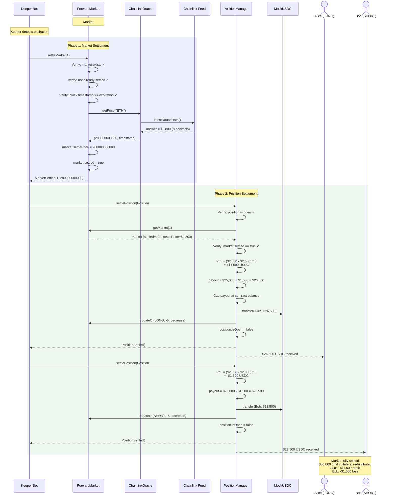
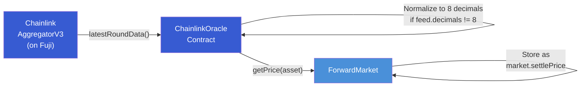
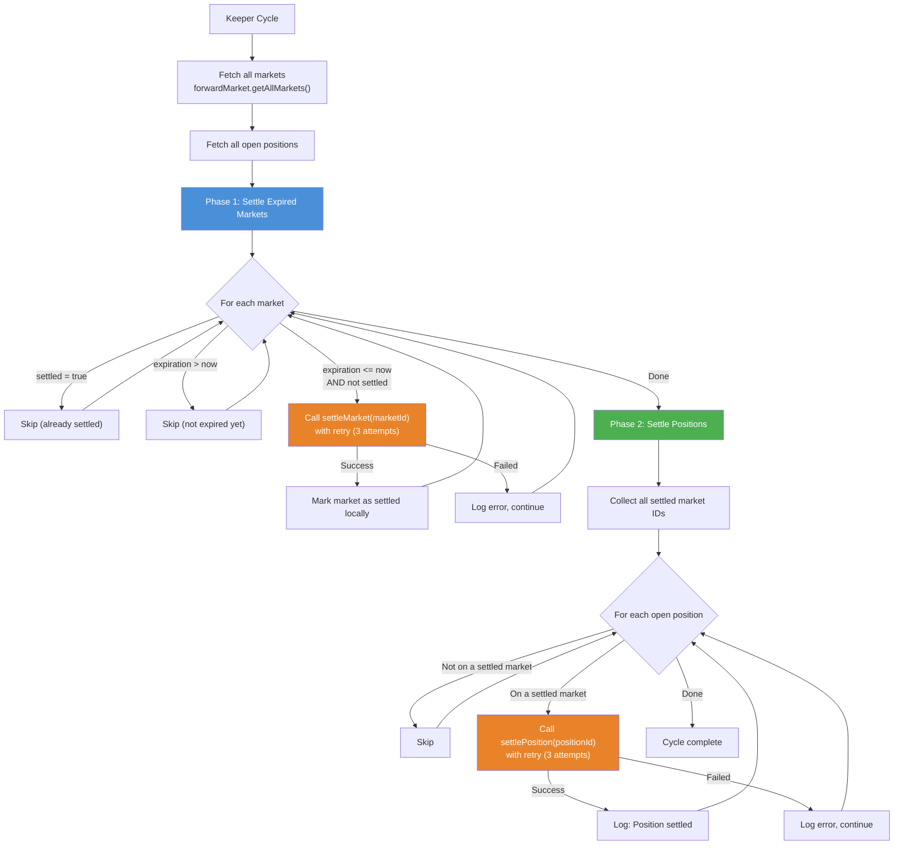

# Forward Settlement

Forward contracts on Tenor expire at a predetermined timestamp. At expiration, the market is settled using the Chainlink oracle price, and all open positions are closed with PnL calculated against that settlement price.

---

## How Forwards Expire

Each market has an `expiration` timestamp set at creation. Once `block.timestamp >= expiration`, the market can be settled. Settlement is a two-phase process:

1. **Market settlement** -- Lock the oracle price as the definitive settlement price
2. **Position settlement** -- Close each position and distribute payouts

Both phases are permissionless: anyone can call the settlement functions. In practice, the keeper bot handles this automatically.

---

## Settlement Flow



---

## Settlement Price

The settlement price is determined by a single call to the ChainlinkOracle at the moment `settleMarket()` is executed. This price is:

- Read from the Chainlink AggregatorV3 on-chain price feed (if registered for the asset)
- Normalized to 8 decimals
- Stored permanently in `market.settlePrice`
- Used for all subsequent position settlements on that market

Once set, the settlement price is immutable. The `settled` flag prevents re-settlement.

### Oracle Price Path



If no Chainlink feed is registered for the asset, the oracle falls back to a manually-set fallback price (admin-controlled). For production markets, Chainlink feeds should always be registered.

---

## PnL Calculation at Settlement

PnL is calculated using the MathLib library with the market's settlement price as the exit price:

```solidity
// For LONG positions:
PnL = (settlePrice - entryPrice) * size * COLLATERAL_PRECISION / PRICE_PRECISION

// For SHORT positions:
PnL = (entryPrice - settlePrice) * size * COLLATERAL_PRECISION / PRICE_PRECISION
```

### Payout Logic

```
if PnL >= 0:
    payout = collateral + PnL
    payout = min(payout, contract USDC balance)  // safety cap
else:
    loss = |PnL|
    payout = max(collateral - loss, 0)           // cannot go negative
```

The safety cap ensures a payout never exceeds the actual USDC held by the PositionManager. In a well-collateralized system, this cap should never be binding.

### Worked Example

| Parameter | Alice (LONG) | Bob (SHORT) |
|---|---|---|
| Entry price | $2,500.00 | $2,500.00 |
| Settlement price | $2,800.00 | $2,800.00 |
| Size | 5 contracts | 5 contracts |
| Collateral deposited | $25,000 USDC | $25,000 USDC |
| PnL | +$1,500 | -$1,500 |
| Payout | $26,500 | $23,500 |
| Return | +6.0% | -6.0% |

---

## Batch Settlement

The keeper bot automates settlement in its regular polling cycle. The `checkAndSettle()` service handles both phases:



### Settlement Order

1. **Markets first** -- All expired, unsettled markets are settled before any positions
2. **Positions second** -- Only positions on settled markets are processed
3. **Sequential execution** -- Each settlement call waits for confirmation before proceeding to the next
4. **Retry logic** -- Each call has 3 retry attempts with exponential backoff (1s, 2s, 3s)

This ordering guarantees that `settlePosition()` is never called before `settleMarket()` has recorded the settlement price.

---

## Settlement Guards

The contracts enforce several safety checks:

### ForwardMarket.settleMarket()

| Check | Error Message |
|---|---|
| Market exists | `ForwardMarket: market not found` |
| Market not already settled | `ForwardMarket: already settled` |
| Market is expired | `ForwardMarket: not expired` |
| Oracle returns valid price | `ChainlinkOracle: invalid price from feed` |

### PositionManager.settlePosition()

| Check | Error Message |
|---|---|
| Position is open | `PositionManager: position closed` |
| Market is settled | `PositionManager: market not settled` |

### Pre-Expiry Guards

Before expiration, these functions are blocked:
- `settleMarket()` -- Reverts with "not expired"
- `settlePosition()` -- Reverts with "market not settled"

Before expiration, positions must be closed via `closePosition()` (early exit at mark price) rather than settled.

---

## Settlement vs Other Exit Methods

| Method | Trigger | Price Source | When Available |
|---|---|---|---|
| **Settlement** | Market expired + `settleMarket()` called | Locked settlement price | After expiration only |
| **Early Close** | Trader calls `closePosition()` | Live oracle mark price | Before expiration only |
| **TP/SL Close** | Keeper detects price trigger | Live oracle mark price | Before expiration only |
| **Liquidation** | Health factor < 100% | Live oracle mark price | Before expiration only |

After a market is settled, the only way to close a position is through `settlePosition()`. The `closePosition()` function explicitly requires `!market.settled`, directing users to the settlement path instead.
