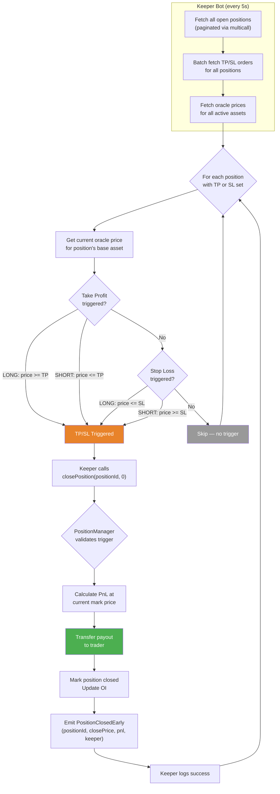
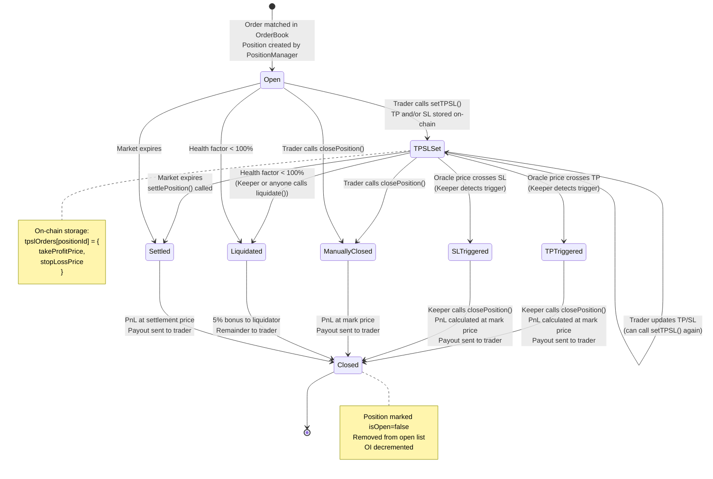
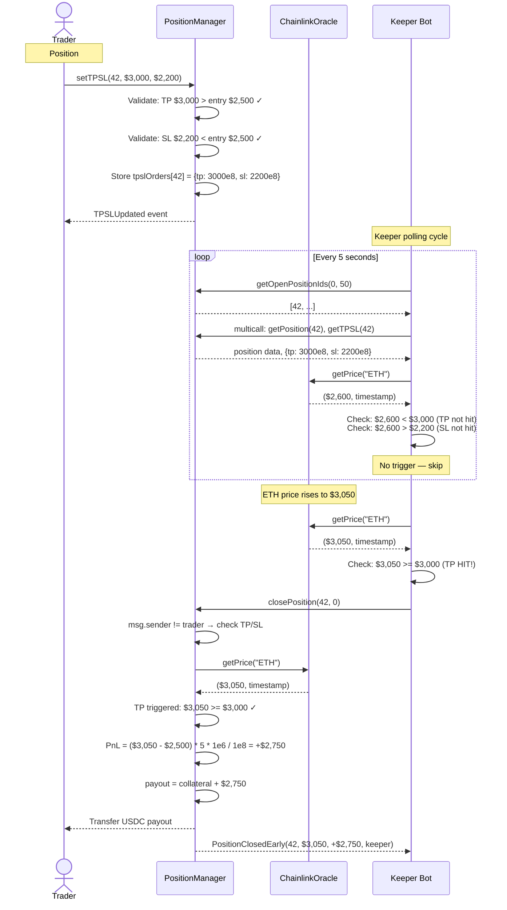

# Take Profit / Stop Loss (TP/SL)

Tenor supports on-chain TP/SL orders that are stored in the PositionManager contract and executed by an off-chain keeper bot. This allows traders to set automatic exit conditions that trigger when the oracle price reaches specified levels.

---

## How TP/SL Works

1. **Trader sets TP/SL** -- After opening a position, the trader calls `setTPSL(positionId, tp, sl)` on the PositionManager. Both values are optional (pass 0 to skip).

2. **On-chain storage** -- TP/SL prices are stored in the `tpslOrders` mapping:
   ```solidity
   struct TPSLOrder {
       uint256 takeProfitPrice; // 8 decimals. 0 = not set
       uint256 stopLossPrice;   // 8 decimals. 0 = not set
   }
   ```

3. **Keeper monitors** -- The keeper bot polls all open positions every 5 seconds, batch-fetches their TP/SL values via `multicall`, and checks them against current oracle prices.

4. **Trigger conditions** -- When the oracle price crosses the threshold:
   - **LONG Take Profit:** `markPrice >= takeProfitPrice`
   - **LONG Stop Loss:** `markPrice <= stopLossPrice`
   - **SHORT Take Profit:** `markPrice <= takeProfitPrice`
   - **SHORT Stop Loss:** `markPrice >= stopLossPrice`

5. **Execution** -- The keeper calls `closePosition(positionId, 0)` which performs a full close at the current oracle mark price. The contract validates that the caller is either the position owner or that TP/SL conditions are actually met.

---

## Validation Rules

The contract enforces directional constraints when setting TP/SL:

| Position Side | Take Profit | Stop Loss |
|---|---|---|
| **LONG** | Must be **above** entry price | Must be **below** entry price |
| **SHORT** | Must be **below** entry price | Must be **above** entry price |

Setting either value to 0 disables that trigger. Both can be updated at any time by calling `setTPSL()` again.

---

## TP/SL Execution Flow



---

## Position Lifecycle with TP/SL



---

## TP/SL Sequence Diagram



---

## Frontend Integration

The trading UI integrates TP/SL directly into the order placement flow:

1. The `TradeForm` component includes TP and SL input fields alongside the order form
2. When a new position is detected (via `useUserOpenPositions` polling), the component automatically calls `setTPSL()` on the new position with the values from the form
3. Estimated gain/loss is displayed in real-time based on the TP/SL values, entry price, and position size
4. Return on equity (ROE) percentages are calculated for both TP and SL scenarios

### Estimated Gain/Loss Calculation

```
TP gain (LONG) = (tpPrice - entryPrice) * size * COLLATERAL_PRECISION / PRICE_PRECISION
TP ROE = gain / collateralRequired * 100%

SL loss (LONG) = (entryPrice - slPrice) * size * COLLATERAL_PRECISION / PRICE_PRECISION
SL ROE = loss / collateralRequired * 100%
```

---

## Keeper Implementation Details

The TP/SL keeper service (`keeper/src/services/tpslKeeper.ts`) processes positions in a single pass:

1. Iterates through all open positions
2. Looks up each position's TP/SL from the pre-fetched map
3. Skips positions with no TP and no SL set
4. Resolves the base asset's current price from the pre-fetched price map
5. Evaluates trigger conditions based on position side (LONG/SHORT)
6. On trigger, calls `closePosition(positionId, 0)` with retry logic (3 attempts, exponential backoff)
7. Logs the result (success or failure)

The retry mechanism (`keeper/src/utils/retry.ts`) handles transient RPC errors:
- 3 attempts maximum
- Exponential delay: 1s, 2s, 3s
- Returns `null` if all retries are exhausted (does not crash the keeper loop)

---

## Comparison: Settlement vs Early Close vs TP/SL

| | Settlement | Early Close | TP/SL |
|---|---|---|---|
| **When** | After market expiration | Any time before expiry | When price reaches target |
| **Who triggers** | Anyone (keeper or trader) | Position owner only | Keeper bot (or anyone) |
| **Price used** | Market's locked settlement price | Current oracle mark price | Current oracle mark price |
| **Function** | `settlePosition()` | `closePosition()` | `closePosition()` (with TP/SL check) |
| **Partial close** | No (always full) | Yes (`closeSize` parameter) | No (always full close) |
| **On-chain validation** | `market.settled == true` | `msg.sender == trader` | TP/SL conditions met |
